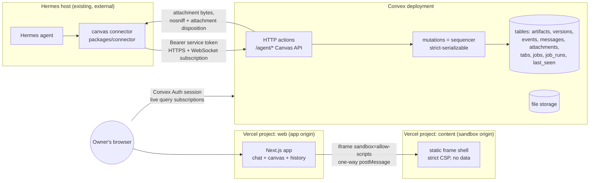

# Fable staged implementation plan — Hermes Canvas MVP

Execution-ready plan for an Opus agent team. Successor to `docs/implementation-options.md`; supersedes its open decision. **Decision taken: Option A** — Next.js on Vercel (frontend) + Convex (state, version history, realtime, file storage). **Hermes remains an external agent** writing through a validated Canvas API; there is no watcher AI and no agent loop hosted inside Convex — which also retires the "where does the agent loop run" spike from the options doc.

**Scope note (binding, and honest about the delta):** this MVP includes sandboxed static-HTML artifacts, Kanban/status boards, and a cron/scheduled-job viewer — items the research recommended deferring. The evidence-backed mitigations are preserved by *sequencing*: the append-only version/diff core (the product thesis) ships and gates before any of the three, the HTML sandbox uses the full §5 security spec unmodified, and boards/cron are built as thin, schema-validated types rather than products of their own. No implementation code is in this document; it is the work order.

All Convex/Vercel pricing figures referenced were verified 2026-07-13 (`research/catalog.md`); the executing team re-verifies at Phase 0.

---

## 1. System architecture



Load-bearing properties, each inherited from the evidence base:

- **One writer path.** Every state change — human or agent — lands as a Convex mutation. Convex mutations are strict-serializable, so the §3 write-serialization policy of the options doc falls out of the platform: concurrent writes cannot destroy data; they land as sequential versions and mismatches are flagged `contended`.
- **Server-authoritative live updates.** Every browser view is a Convex live query; reconnect = automatic full re-sync. No hand-built socket protocol, no client reconciliation code.
- **Hermes never touches storage.** Its only write path is the validated Canvas API. The server records ground truth (`resolved_action`) for every write; the agent's self-description is never trusted as the record (Replit/GhostApproval lessons).
- **Three origins, three trust levels.** App origin (authenticated UI), Convex origin (data + attachment serving with hostile-upload headers), content origin (sandboxed artifact HTML, opaque-origin iframes, zero egress). `*.vercel.app` is on the Public Suffix List, so two Vercel projects are genuinely cross-site — **no domain purchase is required for MVP**.

## 2. The Canvas API — exactly how Hermes writes

### 2.1 Transport and authentication

- **Endpoint base:** Convex HTTP actions at `https://<deployment>.convex.site/agent/*`.
- **Auth:** `Authorization: Bearer ${HERMES_SERVICE_TOKEN}` — a 256-bit random token generated at provisioning, stored as a Convex environment variable (compared constant-time, stored hashed) and in Hermes' runtime env. No OAuth, no expiry ceremony; rotation = replace env var on both sides. This token is distinct from human auth (§6) and grants exactly the `/agent/*` surface, nothing else.
- **Reading/waiting:** the connector package (`packages/connector`, plain Node, shipped to the Hermes host) opens a Convex WebSocket client subscription to a `pendingWork` query (new user messages, unacked events), authenticated by the same token passed as a query argument and verified server-side by hash comparison. This costs function calls only on change — a 24/7 HTTP poll would burn ~1.7M calls/month against the 1M free tier, so polling is the *fallback* (`GET /agent/updates?cursor=`), not the default.

### 2.2 Endpoints (API v1 — frozen at Gate G1)

All request/response bodies are zod-validated in `packages/contract`; the same schemas generate the OpenAPI file and Hermes' tool manifest, so the contract cannot drift in three places.

| Method + path | Purpose | Key rules |
|---|---|---|
| `GET /agent/updates?cursor=` | New user messages + events since cursor | Fallback to the WS subscription |
| `POST /agent/messages` | Post/stream an assistant chat message | `{text}` or `{stream_id, delta, done?}`; chunks coalesced ≥500 ms; 32 KB/message |
| `GET /agent/attachments/:id` | Read a user-shared file | Same bytes the human sees |
| `GET /agent/artifacts` · `GET /agent/artifacts/:id?seq=` | Read canvas state / any historical version | |
| `POST /agent/artifacts` | Create artifact | `{type, title, tab_id?, content, why}` — `why` required, 256 KB cap |
| `PATCH /agent/artifacts/:id` | Update | `{parent_seq, why, edit}` where `edit` = `{mode:'replace_all', content}` or `{mode:'region', anchor:{heading}\|{start_line,end_line}, content}` |
| `POST /agent/artifacts/:id/archive` | Soft-archive (reversible) | **No delete endpoint exists** |
| `PUT /agent/tabs` · `PATCH /agent/tabs/:id` | Create/rename/reorder tabs | Archive-only removal |
| `PUT /agent/jobs/:key` | Register/update a scheduled job | `{name, schedule_cron, description, source}` |
| `POST /agent/jobs/:key/runs` | Report a run | `{run_id, status:'started'\|'succeeded'\|'failed', started_at, finished_at?, summary?, log_tail?}` (log_tail ≤16 KB) |

Server-side enforcement on every write (in the mutation, not the HTTP layer, so no bypass exists):

- **Validation:** type-specific — Mermaid parsed at write time (parse failure stored but flagged `render_error` so the UI shows error + raw source, never a blank); Markdown stored raw, sanitized at render; `board` content must match the board JSON schema; `html-static` accepted as opaque text (its safety is the renderer's job, §5). Oversize → **visible rejection with the limit named**, never truncation.
- **Sequencing:** `seq` assigned by the mutation, strictly increasing per artifact. If `parent_seq ≠ head_seq`, the write still lands (append-only — data loss impossible) and is flagged `contended`; the UI surfaces a merge prompt.
- **Region resolution:** for region edits the server resolves the anchor against the `parent_seq` content, produces the full new snapshot, and records the resolved byte range. Whole-document writes are permitted but labeled `replace_all` in the diff header (C3: region edits are the defense against the incumbent truncation/overwrite failures).
- **Rate/size limits:** 20 writes/min/artifact, 60 agent writes/min global, 256 KB/version, 10 MB/attachment, 32 KB/message — thrash protection and injection blast-radius control. Exceeding → 429 with a structured error the agent can read.
- **Ground truth:** `resolved_action` (op, real target, region/byte-range, resulting seq) is written by the server from what actually happened. Required-`why` + server-`resolved_action` together are the audit pair: the agent's *stated intent* and the system's *record of effect*, displayed side by side.

### 2.3 How Hermes uses it

Hermes gets a tool manifest (generated from `packages/contract`, checked into `docs/agent-api.md`) — one tool per endpoint. Example:

```json
{
  "name": "canvas_update_artifact",
  "description": "Update a canvas artifact. Prefer region edits; always base on the seq you last read.",
  "input_schema": {
    "type": "object",
    "required": ["artifact_id", "parent_seq", "why", "edit"],
    "properties": {
      "artifact_id": {"type": "string"},
      "parent_seq": {"type": "integer"},
      "why": {"type": "string", "maxLength": 200},
      "edit": {"oneOf": [
        {"properties": {"mode": {"const": "replace_all"}, "content": {"type": "string"}}},
        {"properties": {"mode": {"const": "region"},
                        "anchor": {"oneOf": [{"properties": {"heading": {"type": "string"}}},
                                              {"properties": {"start_line": {"type": "integer"},
                                                              "end_line": {"type": "integer"}}}]},
                        "content": {"type": "string"}}}
      ]}
    }
  }
}
```

The connector translates tool calls to authenticated HTTPS requests and returns the structured result (including new `head_seq` and any `contended` flag) so Hermes can chain edits correctly. The system prompt addendum for Hermes (delivered with the manifest) states the three behavioral rules the evidence demands: read-before-write (fresh `parent_seq`), region edits over regeneration, honest one-line `why` per write.

## 3. Version, diff, and event records

Tables (Convex schema, `packages/contract` types are the single source):

```
artifacts   { _id, tab_id, type: 'markdown'|'mermaid'|'html-static'|'board',
              title, status: 'active'|'archived', created_by, head_seq }
versions    { artifact_id, seq, parent_seq, content, content_size,
              author: 'human'|'agent', agent_turn_id?, why?, contended: bool,
              resolved_action: {op, target?, region?, byte_range?}, created_at }
events      { seq (global), kind: 'message'|'artifact_created'|'artifact_updated'|
              'artifact_archived'|'tab_changed'|'job_registered'|'job_run'|
              'auth'|'limit_rejected', actor, refs {artifact_id?, message_id?,
              job_key?, version_seq?}, at }
messages    { role, body, status: 'streaming'|'complete', attachments[], turn_id }
attachments { file_id (Convex storage), name, mime, size, sha256, uploaded_by }
tabs        { title, order, status: 'active'|'archived' }
jobs        { key, name, schedule_cron, description, source, status, updated_at }
job_runs    { job_key, run_id, status, started_at, finished_at?, summary?, log_tail? }
last_seen   { artifact_id, seq, at }   // one row per artifact (single owner)
```

Rules (all high-confidence findings, now binding):

- **Append-only, never rewritten.** No code path updates or deletes a `versions` or `events` row. Restore = a new version whose content equals an old one, `resolved_action.op = 'restore'`. History that lies is worse than no history.
- **Stable identity.** Updates never mint a new artifact id (the Gemini anti-pattern). `head_seq` is the only mutable pointer.
- **Full snapshots at MVP** (≤256 KB makes this trivial); delta storage is a later optimization, not a correctness feature.
- **Events are written in the same mutation as the action** — transactional, so the activity log can never disagree with the data. Events drive the chat-side system lines ("Hermes updated *Design notes* → v12: 'tightened the auth section'") and the history tab's activity strip. Rejections (`limit_rejected`) are events too: a blocked write is evidence, not silence.
- **Changed-since-you-last-looked:** an artifact is "seen" when its tab is focused and visible ≥1 s (and immediately when its diff is opened); that upserts `last_seen`. Badge = `head_seq > last_seen.seq`, shown per-artifact and aggregated per-tab as a dot. This is the single most-requested legibility feature in the canvas evidence and ships in the core phase, not as polish.
- **Diff rendering** (where legibility actually lives — nbdime lesson):
  - *Markdown:* block-level structural diff, word-level within changed blocks, rendered inline (insertions/deletions highlighted in the rendered output, not raw text). Raw source diff is the fallback view, never the primary.
  - *Mermaid:* source diff + before/after renders side by side.
  - *Board:* semantic card-level diff (added / removed / moved / edited cards, column changes).
  - *HTML:* source diff + before/after sandboxed previews.
  - Every agent version's header shows `why`, `resolved_action`, `contended` state, and author.

## 4. Sandboxed static-HTML artifacts — how they stay safe

Verbatim adoption of the researched recipe, stricter than the incumbents where strictness is free:

- **Separate site:** a second Vercel project (`content` app) on its own `*.vercel.app` host (PSL ⇒ cross-site from the app origin; a custom `-content` domain can be added later without code change). It serves exactly one static shell page plus its bundled runtime — **no data, no cookies, no API routes**.
- **Frame embedding (app side):** `<iframe src="https://<content-host>/frame.html" sandbox="allow-scripts">` — **never** `allow-same-origin` (together they let the frame strip its own sandbox), no `allow-popups`, no `allow-top-navigation`, no `allow-forms`. The frame therefore runs at an opaque origin regardless of host.
- **Content delivery:** strictly **one-way postMessage**. Parent waits for the shell's `ready` control message, verifies `event.source === iframe.contentWindow` (an opaque-origin frame reports `origin === "null"`, so source identity is the check on the parent side), then posts `{type:'render', html, artifactId, seq}`. The shell verifies `event.origin` equals the app origin exactly before rendering, and is only permitted to send whitelisted control messages back (`ready`, `height`, `render_error`) — never content. This is the Claude/SafeContentFrame pattern including the origin-verification bug-class fix.
- **Shell CSP (static headers via `vercel.json`), the egress kill:**
  `default-src 'none'; script-src 'self' 'unsafe-inline'; style-src 'unsafe-inline'; img-src data: blob:; connect-src 'none'; form-action 'none'; base-uri 'none'; frame-ancestors <app-origin>` + `X-Content-Type-Options: nosniff`.
  `'unsafe-inline'` script is deliberate and safe *in this frame only*: the origin is opaque (no cookies/DOM/storage of ours to steal) and every exfil channel is closed — `connect-src 'none'` kills fetch/XHR/WebSocket/beacon, `img-src data: blob:` kills image beacons **including CSS `url()` backgrounds**, sandbox flags kill navigation/popups/forms. An artifact can compute; it cannot phone home. **Zero external origins, no CDN allowlist** — stricter than Claude's cdnjs posture, per the EchoLeak/script-src-exfil analysis, and it costs nothing at this scope.
- **Failure visibility:** any render error posts `render_error` and the app shows the error inline with the raw source. Blocked capabilities must never look like success (the Claude localStorage silent-failure anti-pattern).
- **Performance rule:** only the focused artifact mounts a live iframe; background HTML artifacts show their last static state with an "activate" affordance (live iframes are disproportionately heavy).
- **App origin hardening (same phase):** the Next.js app ships its own CSP with `img-src 'self' data: blob: https://<convex-site>` and no external scripts/styles/fonts — this closes the Markdown image-beacon channel *app-wide* (the exact pattern that leaked ≥7 major products). External images in agent Markdown render as a visible broken-image state showing the target URL: exfil *attempts* become audit evidence. Markdown sanitizer: no raw HTML pass-through, no event handlers, `javascript:` stripped. Mermaid at `securityLevel: 'strict'`. Attachments served only through a Convex HTTP action that checks auth and sets `Content-Disposition: attachment` + `nosniff` (uploaded HTML/SVG must never render inline — stored-XSS advisories).

## 5. Cron / scheduled-job viewer — how the data gets in

Hermes' scheduled jobs live wherever Hermes runs; the Canvas is their **reporting surface**, not their scheduler.

- The Hermes host registers each job once via `PUT /agent/jobs/:key` (name, cron expression, description, source) and posts `POST /agent/jobs/:key/runs` at run start and completion — two lines in a job wrapper, provided ready-made by `packages/connector` (`withRunReporting(key, fn)`).
- The viewer is a dedicated tab type rendering `jobs` + `job_runs` live: schedule (human-readable via client-side cron parsing), computed next-run, last-run status, run history with `log_tail`, and **overdue detection** — if now > next expected run + grace and no run was reported, the job row shows a visible "missed / not reporting" state. A dead scheduler that looks healthy is exactly the silent-failure class this product exists to expose.
- Convex's own scheduled functions are used for one internal job only (weekly snapshot export reminder, §9); they are listed in the same viewer via self-registration so the surface is complete.
- Job runs emit `events`, so cron failures appear in the chat/system feed too, not only in the tab.

## 6. Auth — closed owner, minimum complexity

**Choice: Convex Auth (`@convex-dev/auth`) with the Password provider, sign-up disabled, allowlist of one.**

- The only account that can ever exist is `OWNER_EMAIL` (Convex env var). The sign-up path is compiled out; the sign-in mutation rejects any other email before touching credentials. Frank sets the password on first sign-in (a one-time seeded invite flow).
- Sessions are Convex Auth JWTs; every query/mutation outside `/agent/*` requires the authenticated owner identity. The Next.js middleware redirects unauthenticated visits to the sign-in page, but authorization is enforced in Convex functions — the frontend is not a trust boundary.
- **Why not OAuth/Clerk/Access:** no third-party provider dance (GitHub OAuth would work but adds a one-time OAuth-app registration and callback config for zero capability gain at one user); Clerk was rejected on evidence (R5); Cloudflare Access can't protect the browser→Convex WebSocket path anyway, so it would secure only half the surface here. Password-provider-with-no-signup is the smallest honest closed-owner design on this stack. Optional hardening later: TOTP second factor (library-supported), or fronting with Access if the domain ever moves behind Cloudflare.
- **Unavoidable provider/account actions, stated honestly:** one-time browser logins to create/link the Convex project (`npx convex login`) and the two Vercel projects (`vercel login`), and setting the owner password once. That is the entire human auth surface. The Hermes service token (§2.1) is generated and installed by the agents if they can reach Hermes' env; otherwise Frank pastes one env var.

## 7. Agent team (all Opus) — ownership and boundaries

Seven build agents + one verification agent. Ownership is by **path**; no two agents write the same path. Cross-cutting needs are expressed as owned packages that others consume, never as shared files.

| Agent | Charter | Owns (exclusive write) |
|---|---|---|
| **ATLAS** — platform & foundations | Monorepo scaffold (pnpm + turborepo), Next.js + Convex wiring, Convex Auth closed-owner flow, env/secret management, provisioning scripts, CI pipeline definition, deploy + rollback runbook | root configs, `apps/web/app/(auth)`, `apps/web/convex/auth*.ts`, `.github/`, `scripts/`, `docs/runbook.md` |
| **LEDGER** — contract & Canvas API | The §2–§3 core: schema, sequencer mutations, events, rate limiter, `/agent/*` HTTP actions, region-edit resolution, jobs/runs API, the connector package, tool manifest + `docs/agent-api.md`, mock-Hermes driver | `packages/contract`, `apps/web/convex/` (except `auth*`, `files*`), `packages/connector`, `tools/mock-hermes` |
| **COURIER** — chat & attachments | Chat pane UI, streaming message rendering, composer, upload flow with caps and progress, attachment previews; consumes WARDEN's serving-policy module | `apps/web/components/chat/`, `apps/web/convex/files.ts` (serving action imports WARDEN's header policy verbatim) |
| **PANES** — canvas shell & renderers | Two-pane layout with resizable divider (persisted), tab bar + tab lifecycle UI, Markdown renderer (consuming WARDEN's sanitizer config), Mermaid renderer (strict), board renderer + drag interactions, cron viewer tab, error/empty states | `apps/web/components/canvas/`, `apps/web/components/board/`, `apps/web/components/jobs/`, `packages/render` |
| **CHRONICLE** — history, diff & legibility | Diff engine (markdown structural+word, mermaid, board semantic, html source), version timeline UI, restore flow, changed-since-last-looked (`last_seen` logic, badges), contended-write merge prompt, readership-test instrumentation | `packages/diff`, `apps/web/components/history/`, `apps/web/convex/lastSeen.ts`, `apps/web/convex/metrics.ts` |
| **WARDEN** — security | Threat model doc, the content-origin app (sandbox shell + postMessage protocol + CSP headers), `packages/policy` (sanitizer config, CSP constants, attachment header policy, limits), security test suite, **sign-off authority on gates G2, G5, G7** | `apps/content/`, `packages/policy`, `e2e/security/`, `docs/threat-model.md` |
| **GLASS** — UI & interaction design | Design system: tokens (color/type/space/radius/shadow), dark/light theming, component primitives, motion standards, the polish pass; **design sign-off on every UI-bearing gate**. Direction: Apple-calibre restraint — system font stack, neutral surfaces with one accent, hairline borders, 8-pt spacing grid, 150–200 ms ease-out motion, honest empty/loading/error states, full keyboard focus states, no gradient-and-glow slop. Dark and light are first-class from Phase 0 (CSS variables + `prefers-color-scheme` + persistent toggle), never a retrofit. | `packages/ui`, `apps/web/app/globals.css`, `apps/web/app/layout.tsx` theming, `docs/design-language.md` |
| **PROOF** — integration & verification | Playwright e2e harness (non-security specs), convex-test conventions, the chatty-agent billing probe, gate checklists and their execution, release checklist, backup/export verification | `e2e/` (except `e2e/security/`), `tools/billing-probe`, `docs/gates.md` |

Interface rule: anything two agents both need lives in a package owned by exactly one of them (`contract` → LEDGER, `policy` → WARDEN, `ui` → GLASS, `diff` → CHRONICLE, `render` → PANES). Consumers pin against the package API; change requests are filed to the owner, not patched in place.

## 8. Phases, dependency order, gates

Dependency spine: **P0 → P1 → (P2 ∥ P3) → P4 → (P5 ∥ P6) → P7.** P2/P3 start only after the **G1 contract freeze**; P5/P6 start only after the **G4 core-thesis gate** (the audit core ships before the deferred-then-reinstated renderers, preserving the research's sequencing logic inside the binding scope). Risky surfaces (`html-static`, boards, cron tab) sit behind server-side feature flags, default-off in prod until their gate passes — rollback is a flag flip, not a revert.

### Phase 0 — Foundations (ATLAS + GLASS)
Scaffold monorepo; provision Convex + two Vercel projects; closed-owner auth end-to-end; CI (typecheck, lint, unit, e2e smoke) runnable locally and in CI; deploy + rollback runbook; design tokens, theming (dark/light), base primitives; re-verify pricing figures.
**Gate G0:** deployed skeleton reachable; sign-in works for `OWNER_EMAIL` and *provably* rejects any other email (test); dark/light both render; CI green; runbook exercised once (deploy → rollback → redeploy).

### Phase 1 — Contract core & Canvas API (LEDGER)
Full schema; sequencer + events; validation, limits, rate limiter; all `/agent/*` endpoints; region-edit resolution; connector + WS subscription + poll fallback; mock-Hermes driver exercising every endpoint; tool manifest + `docs/agent-api.md`.
**Gate G1 — contract freeze:** convex-test suite proves: seq strictly monotonic under concurrent writes; stale `parent_seq` ⇒ both versions land + `contended` flag; oversize ⇒ structured rejection + `limit_rejected` event, never truncation; restore appends; no code path mutates `versions`/`events`; rate limits return structured 429s. Mock-Hermes runs a full scripted session green. Billing probe #1: simulated heavy day extrapolates to <30% of Convex free-tier monthly bands. After G1, API v1 and schema change only additively.

### Phase 2 — Chat, attachments, live loop (COURIER; WARDEN policy module)
Chat pane with streaming render; uploads (10 MB cap, progress, failure states); attachment serving through the policy headers; connector driving a real Hermes (or mock) round trip; system event lines in chat.
**Gate G2 (WARDEN co-sign):** e2e: user message → agent reply streams live; kill the network mid-stream → reconnect resyncs to a consistent state with no duplicate/lost messages; upload a `.html`/`.svg` file → served as download with `nosniff` (asserted headers), never rendered; oversize upload → visible rejection.

### Phase 3 — Canvas shell + Markdown/Mermaid (PANES + GLASS)
Two-pane layout, resizable divider with persistence; tab bar (create/rename/reorder/archive); Markdown renderer (sanitized) and Mermaid renderer (strict) with inline error + raw-source states; app-origin CSP live.
**Gate G3 (GLASS design sign-off):** mock-Hermes writes markdown + mermaid → appear live without refresh; invalid Mermaid shows error + source (never blank); `` in agent markdown does **not** load and shows the visible broken-image-with-URL state (network-asserted in e2e); pane size and tab layout survive reload; dark/light audit passes.

### Phase 4 — History, diffs, changed-since-last-looked (CHRONICLE) — **the product core**
Diff engine + fixtures; version timeline with `why`/`resolved_action`/author/contended per version; rendered inline markdown diff, mermaid side-by-side; restore flow (confirm + shows resolved action); badges per artifact/tab; merge prompt for contended writes; readership instrumentation (diff opens, badge clicks, restores, time-to-first-view) writing to `metrics`.
**Gate G4 — thesis gate (PROOF executes, Fable reviews):** diff fixtures pass including adversarial cases (whole-doc rewrite labeled as such; region edit shows only region); restore provably appends (chain unchanged); badges set on agent write, cleared on view, aggregate to tab dots; a scripted 20-write agent session is fully reconstructable from the UI alone — every write's what/why/when visible. MVP demo of the actual pitch happens here.

### Phase 5 — Sandboxed HTML artifacts (WARDEN builds sandbox; PANES integrates tile; GLASS chrome) — flag `html_artifacts`
Content-origin shell app + headers; postMessage protocol both-ends verification; app-side host component; focused-tab-only live mounting; before/after preview support for CHRONICLE's diff view.
**Gate G5 — security audit (WARDEN sole sign-off):** e2e security suite runs hostile artifacts asserting **zero** network egress (fetch/XHR/WebSocket/beacon/``/CSS `url()`/form-post/prefetch all blocked, network-intercept-asserted) and no navigation/popup escape; header assertions on the deployed content origin in CI; parent ignores non-whitelisted messages; frame verifies origin; `allow-same-origin` grep-guard in CI; render errors visible with source. Flag flips on only after this gate.

### Phase 6 — Kanban boards + cron viewer (PANES; LEDGER API from P1; CHRONICLE board diff) — flags `boards`, `jobs_tab`
Board renderer (columns/cards, drag = one mutation = one version), board JSON schema already frozen in contract; cron tab with live runs, next-run computation, overdue detection; board card-level diff.
**Gate G6:** agent creates/updates a board via API and human drags a card → both land as versions; simultaneous human+agent board edit → contended flag + merge prompt (not silent loss); job registered + run reported via API appears live; a job that stops reporting shows overdue within its grace window; board diff renders add/move/remove correctly.

### Phase 7 — Hardening, polish, launch (all; PROOF leads; WARDEN + GLASS sign-offs)
Full-regression e2e; billing probe #2 against real usage patterns; backup/export flow verified (snapshot export restores into a scratch deployment); GLASS polish pass (spacing/motion/contrast/keyboard/empty-states); WARDEN re-audit including a prompt-injection fire drill (hostile attachment instructs Hermes to exfiltrate → confirm every channel dead-ends visibly and the attempt is an audit event); docs complete (runbook, agent-api, threat-model, design-language).
**Gate G7 — launch:** all flags on in prod; checklists green; 4-week readership test (options doc §6) begins with instrumentation live. Kill/keep criteria unchanged: unread badges + unopened diffs + write-only artifacts ⇒ stop investing in versioning UX beyond safety-floor rollback; do not respond by adding renderers.

## 9. Migration & rollback posture

- **Code:** Vercel immutable deployments — rollback is instant re-promotion of the previous build. Convex functions deploy atomically from git; rollback = redeploy prior commit. The runbook (G0) scripts both.
- **Schema/data:** additive-only after G1 (new tables/optional fields; never repurpose or drop in MVP). Forward-only migrations via Convex's migration pattern with backfill; destructive migrations are out of scope by rule. Because `versions`/`events` are append-only, **data rollback is never required** — bad writes are superseded, not excised.
- **Features:** server-side flags (`html_artifacts`, `boards`, `jobs_tab`) — regression response is a flag flip (seconds), then a fix; artifacts written while a flag was on remain stored and re-render when it returns.
- **Backups:** weekly `npx convex export` snapshot (scheduled reminder + scripted), retained locally/off-site; restore path verified once in Phase 7, not assumed.
- **Secrets:** service-token rotation = generate → set Convex env → set Hermes env → old token dead; documented in the runbook. No secrets in the repo, ever.
- **Cost watch:** billing probes at G1 and G7; a usage dashboard card (function calls/day) inside the cron tab so overage creep is visible in-product. Vercel Hobby is non-commercial — acceptable for the personal MVP; the T7 product pivot triggers Vercel Pro + Convex Pro (~$45/mo) and a fresh auth review (that is when Clerk-class tooling gets re-evaluated, not before).

## 10. Standing risks the team carries

1. **Scope reinstatement risk:** HTML/boards/cron re-entered scope against research advice. Containment = sequencing (after G4), flags, and thin implementations. If P5/P6 threaten the core's quality, they slip — the thesis gate does not.
2. **"Render" drifting toward "execute":** the moment an HTML artifact needs network or persistence, it has left the cheap tier. Standing rule: such requests become hosted-elsewhere links, not sandbox relaxations. WARDEN owns the "no" — any CSP/sandbox relaxation requires a written threat-model amendment.
3. **Convex free-tier meter:** a chatty Hermes multiplies live-query re-runs. Probes at G1/G7 + in-product usage card; overflow contingency is pay-as-you-go dollars, not architecture change.
4. **Readership bet still unproven:** the MVP *is* the experiment; instrumentation is a Phase 4 deliverable with the same priority as the diff renderer itself.

---

## What Frank must do to unblock MVP

- **One-time provider authorizations (~15 minutes total, not blockers to planning or code):**
  - Log in once to Convex (`npx convex login`) and Vercel (`vercel login`) on this machine so the agents can provision the project and the two deployments autonomously thereafter.
  - Set your owner password on the first sign-in to the deployed app.
- **One config paste, only if agents can't reach Hermes' environment:** set `HERMES_SERVICE_TOKEN` (agent-generated) and the Canvas API base URL in Hermes' runtime, and load the provided tool manifest into Hermes' tool config. If the agents have write access to Hermes' host config, this is autonomous too.
- **Nothing else.** No domain purchase (PSL-separated `*.vercel.app` origins satisfy the security spec; a custom domain is optional polish later), no OAuth app registration, no Cloudflare setup, no payment method required at MVP scale.
- **After launch (participation, not a blocker):** actually use the tool daily for the 4-week readership test — the one thing that cannot be delegated to an agent.
