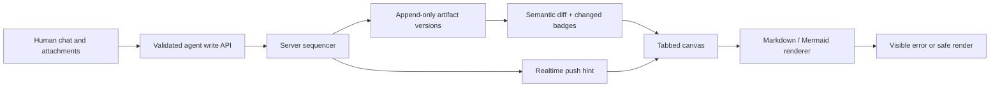

# Hermes Canvas — Research & Architecture Report

> **Status:** Research and adversarial review complete. No application implementation or final stack selection has occurred.

## Executive snapshot

- **65 curated captures** across agent workspaces, artifact canvases, trace viewers, security, live sync, auth, and hosting.
- **Core thesis:** reduce the cost of reviewing agent work with stable artifacts, semantic diffs, visible writes, and server-grounded history.
- **MVP:** one owner, chat + attachments, Markdown/Mermaid canvas tabs, append-only versions, diffs, and live state.
- **Rejected for MVP:** Supabase + Vercel + Clerk; broad renderer support, CRDTs, multi-user collaboration, and interactive HTML.
- **Decision remaining:** Convex-centered versus Cloudflare Durable Objects; a short agent-runtime and billing spike decides it.

## System diagram



# Product brief

# Hermes Canvas

A public-hosted, authenticated workspace for a human and Hermes agent to work together.

## Product brief

- Left: resizable chat/messaging pane with basic file and image attachments.
- Right: a large canvas that can hold agent-created HTML containers, Markdown renderers, diagrams, and multiple tabbed workspaces (for example Kanban/status boards).
- The agent should be able to create, update, and link artifacts while the human sees clear current state.
- Authentication and hosting should stay simple and inexpensive.
- Initial use case: make agent work legible and auditable; possible future product.

## Research constraints

Research comparable products and patterns before selecting a stack. Include positive and negative lessons from agent workspaces, collaborative canvases, IDE/Copilot surfaces, and project dashboards. Keep source links and clearly distinguish evidence from product opinion.


# Fable pre-research adversarial review

# Fable pre-research review: Hermes Canvas

Adversarial architecture review of `docs/brief.md`, written **before** market research and **before** any implementation. Purpose: name the traps now so the research phase collects evidence against them instead of confirming the pitch.

Scope of the idea under test: a public-hosted, authenticated workspace — resizable chat pane on the left, agent-editable multi-tab canvas (HTML containers, Markdown, diagrams, Kanban-style boards) on the right, for one human working with one Hermes agent.

---

## 1. Likely product traps

**T1. "Chat + canvas" is a UI shape, not a product.** The stated value is "make agent work legible and auditable." Legibility is a *property* incumbents ship for free (Claude Artifacts, ChatGPT Canvas, agent IDE panes). If Hermes Canvas is only the shape, it competes with the default surface of every frontier-lab product. The defensible core, if any, is the **audit trail** (who changed what, when, why) — the brief mentions it once and specifies nothing for it.

**T2. Four renderers = four products.** HTML containers, Markdown, diagrams, and Kanban boards each have their own editing model, failure modes, and persistence. Committing to all four in v1 is scope quicksand. Each renderer added before the audit/versioning core exists is negative progress.

**T3. Collaboration theater.** "Human and Hermes agent" is one human. Reaching for multiplayer machinery (CRDTs, presence, cursors) to serve a single-user tool is the classic over-build. The actual hard problem is narrower and different: **human-vs-agent write contention** on the same artifact (see §3).

**T4. Agent-editable UI has an unbounded output space.** The agent will emit broken HTML, invalid diagram syntax, and layouts that thrash. If the canvas has no schema/contract for what the agent may write, "clear current state" degrades into "whatever the last generation produced." The artifact contract (allowed types, size limits, validation, error rendering) is the real design surface, not the panes.

**T5. "Simple and inexpensive" conflicts with the other requirements.** Public hosting + auth + file uploads + live agent updates (some push channel) + sandboxed arbitrary HTML is not the cheap tier of anything. Either the hosting constraint bends or the feature list does. Decide which before stack selection, not after.

**T6. Audit claim without versioning is a whiteboard.** If the agent overwrites an artifact in place and the human can't see a diff or restore a prior version, the auditability claim is false in the first week of use. Append-only history is not a nice-to-have here; it's the product thesis.

**T7. "Possible future product" is doing a lot of quiet work.** Personal-tool decisions (single-tenant auth, no billing, no isolation between users) and product decisions (multi-tenant, sharing, permissions) diverge immediately. Build explicitly for one user now and write down what a product pivot would invalidate — don't split the difference.

## 2. Security / privacy boundaries

**S1. Agent-generated HTML rendered inside an authenticated app is XSS by design.** This is the single biggest technical boundary. Rendered agent HTML must never execute in the app's origin with the user's session. Non-negotiable baseline: sandboxed iframes on a **separate origin** (or `sandbox` attr without `allow-same-origin`), strict CSP, no access to auth cookies/tokens. This is exactly how Claude Artifacts and similar surfaces do it — research should confirm the specific patterns.

**S2. Prompt injection → exfiltration through the canvas.** Uploaded files/images and any web content the agent reads can carry instructions. An injected agent that can write HTML can exfiltrate chat/workspace contents via ``-style beacons or fetches from the rendered container. Mitigations to design in: block network egress from rendered artifacts (CSP `default-src 'none'` posture, allowlisted assets only), and treat all attachments as untrusted agent input.

**S3. Public-hosted auth surface.** Who can create an account? For a personal tool, the honest answer is "nobody — one owner." Prefer closed signup or a zero-user-management gate (e.g., an access proxy / OAuth allowlist of one) over rolling password auth. Publicly reachable + agent-connected + real credentials is an attractive target for effectively zero users.

**S4. Attachments.** Size limits, content-type validation, serving uploads from a non-app origin with `Content-Disposition`/no-sniff so an uploaded HTML file can't become a stored-XSS vector. Private storage — a public bucket of "auditable agent work" is a data leak.

**S5. The agent's blast radius.** What can Hermes reach *besides* the canvas — repos, email, other tools? The workspace is also the place where a confused or injected agent's actions become visible, which means canvas writes should be attributable and rate-limited, and destructive operations (delete artifact/tab) should be soft-delete.

**S6. The audit log is itself sensitive.** Chat history + artifacts = a full record of work, possibly including secrets pasted into chat. Retention, export, and delete need an answer even for one user.

## 3. Collaboration / canvas failure modes

**F1. Human–agent write contention.** Human edits a Kanban card while the agent rewrites the board → last-write-wins silently destroys one side. You don't need CRDTs for 1 human + 1 agent, but you do need an explicit policy: per-artifact locking, agent-proposes/human-accepts, or field-level merge. Pick one; "we'll deal with it" is how the audit thesis dies.

**F2. Silent staleness.** Human is looking at tab 3; agent updates tab 1. Without unread/changed indicators per tab and per artifact, "clear current state" fails exactly when the agent is most active. Legibility is a notification-and-diff problem as much as a rendering problem.

**F3. Overwrite without diff.** Agent regenerates an artifact wholesale (LLMs prefer regeneration to patching). Human sees the new version and has no idea what changed. Every agent write should land as a diffable revision.

**F4. Artifact sprawl.** Tabs and artifacts accumulate with no lifecycle. Within weeks the canvas is a junk drawer and legibility inverts. Need archive/pin/stale conventions, even crude ones.

**F5. Rendering failures must be legible too.** Invalid Mermaid, malformed HTML, oversized payloads — the failure state should show the error *and the raw source*, never a blank container. A canvas that silently drops broken artifacts hides exactly the agent mistakes the tool exists to expose.

**F6. Transport and reconnection.** Live updates imply a push channel (WebSocket/SSE). Dropped connections mid-update → half-applied state. Canvas state must be reconstructable from the server on reconnect (server is source of truth; the socket is only an invalidation hint).

**F7. Layout state.** Resizable pane and tab arrangement should persist per device/session; minor, but it's the kind of paper cut that makes a daily tool feel broken.

## 4. MVP vs. explicitly deferred

**MVP (earns the thesis):**
- Single-owner auth, closed signup. No user management UI.
- Chat pane with text + basic image/file attachment (hard size limits, private storage).
- Canvas with tabs; artifact types limited to **Markdown + one diagram type (e.g., Mermaid)**.
- **Append-only artifact versioning with visible diffs** — the audit core; ship before any additional renderer.
- Per-tab / per-artifact "changed since you last looked" indicators.
- Server-authoritative state with a live-update channel and clean reconnect.
- Visible error states for failed renders.

**In MVP only if cheap, otherwise first follow-up:** sandboxed static-HTML containers (separate origin, no egress, no interactivity with the host app).

**Explicitly deferred:**
- Interactive HTML apps in containers (postMessage bridges, agent↔widget state sync).
- Kanban/status boards as a first-class structured type (start as Markdown; promote only if usage proves it).
- Multi-user anything: sharing, permissions, presence, real-time co-editing, CRDTs.
- Artifact linking/graph beyond plain hyperlinks between artifacts.
- Mobile layout, offline, export/import, notifications, billing/tenancy.
- Agent tool integrations beyond chat + canvas writes.

## 5. Evidence the research phase must collect

1. **Sandboxing patterns, verbatim.** How Claude Artifacts, ChatGPT Canvas, and tldraw-style "render agent HTML" tools isolate content (origins, CSP, egress policy). Collect actual headers/architectures, not blog summaries.
2. **Documented prompt-injection/exfiltration incidents** in agent surfaces that render markup (there are published write-ups) — use them to validate the S2 threat model.
3. **Do artifacts actually get read?** Usage signals, reviews, and complaints for agent workspaces (Devin, OpenHands, Replit Agent, Claude/ChatGPT canvases): do users inspect intermediate artifacts, or do canvases rot? This tests the core legibility thesis.
4. **How incumbents show agent changes:** diff/revision UX in ChatGPT Canvas, Cursor/Copilot Edits review flows, Notion AI. What do users praise or curse?
5. **Write-contention approaches** in human+agent tools: locking vs. propose/accept vs. free-for-all, and reported failure stories. Confirm or refute "CRDTs unnecessary at 1+1."
6. **Real cost floor** for the required shape (auth + WebSocket/SSE + object storage + DB) on candidate platforms (Cloudflare Workers/DO, Fly, Vercel, VPS) at ~1-user scale — numbers, not tiers.
7. **Auth-for-one patterns:** Cloudflare Access / OAuth-allowlist / passkey single-tenant setups — effort and cost vs. rolling app auth.
8. **Artifact-type usage distribution:** which types (code, docs, diagrams, boards) get used vs. ignored in comparable tools — directly informs which renderers to defer.
9. **Failure-mode reports** for collaborative canvases (Miro/Figma/Excalidraw reviews): sprawl, staleness, performance cliffs with many objects.

## 6. Competing / adjacent categories to investigate

| Category | Examples | Why it matters |
|---|---|---|
| AI chat + artifact surfaces | Claude Artifacts, ChatGPT Canvas, Gemini Canvas | The direct incumbents; steal sandboxing + diff UX, find what they can't do (persistence, multi-tab, audit) |
| Agent workspaces / IDEs | Devin, OpenHands, Replit Agent, Cursor, Copilot Workspace | How agent activity is made legible (plans, terminals, diffs); where users report losing track of the agent |
| Collaborative canvases | Figma/FigJam, Miro, tldraw ("Make Real"), Excalidraw | Canvas interaction patterns and sprawl/staleness failure modes |
| AI docs/wikis | Notion AI, Coda | Structured artifacts + AI edits inside persistent docs; block-level versioning |
| Project dashboards | Linear, Trello, GitHub Projects | What a "status board" must do before a Markdown table stops sufficing |
| Notebook/literate surfaces | Jupyter, Observable, Marimo | Mixed prose/code/output documents; the original "legible computational work" pattern |
| Agent trace/observability tools | LangSmith, AgentOps, Claude Code transcripts | The other approach to "auditable agent work" — traces instead of artifacts; why a canvas beats (or loses to) a trace viewer |
| Sync/collab infrastructure | Yjs, Liveblocks, PartyKit, Durable Objects | Patterns and cost reference for the live-update channel — infrastructure candidates, not competitors |

---

**Bottom line:** the risky bet is not the layout — panes and tabs are commodity. The bets that need evidence are (1) people actually read agent artifacts when they're persistent and diffable, (2) agent HTML can be rendered safely and cheaply, and (3) versioned-artifact auditability is meaningfully better than the trace viewers and canvases that already exist. Research should target those three claims first; everything in §5 maps onto them.


# Research status

# Hermes Canvas — Research Status

**Phase:** 1 — Evidence gathering **COMPLETE** (curation + synthesis done). Ready for Fable post-review.
**Last updated:** 2026-07-13
**Researcher:** primary evidence researcher (agent)

Do not commit/push (per instructions). No secrets in this repo.

## Live counts

| Metric | Count |
|---|---|
| Catalog entries (rows; several bundle 2–3 corroborating URLs) | 63 |
| — Primary/official-led rows (official / standards / eng-blog / press / academic / disclosure) | ~42 |
| — Community/anecdote-led rows | ~16 (remainder mixed official+community) |
| Capture files under `research/sources/` | 65 |
| Observation bullets logged | 65 + cross-cluster synthesis |

Primary vs. community is also separated *within* each capture note and flagged per catalog row (`type` + `confidence` columns).

## Coverage by cluster

| Cluster | Status | Captures |
|---|---|---|
| C1 Direct incumbents (Claude Artifacts, ChatGPT/Gemini Canvas) | ✅ complete | 12 |
| C2 Agent workspaces/IDEs (Cursor, Claude Code, Devin, OpenHands, Replit, Windsurf, Copilot) | ✅ complete | 9 |
| C3 Collaborative canvases (tldraw/Make Real, Excalidraw, Miro, Figma/FigJam) | ✅ complete | 7 |
| C4 Trace/observability + notebooks (LangSmith, Langfuse, AgentOps, Phoenix, Jupyter, Marimo, Observable) | ✅ complete | 12 |
| C5 Sync/auth/attachment infra (Convex, Supabase, Cloudflare DO/R2/Access, Yjs/Liveblocks/PartyKit/Electric, Fly/Railway/Vercel) | ✅ complete | 12 |
| C6 Security & sandboxing (iframe/CSP, prompt-injection & exfil incidents, sandbox tiers) | ✅ complete | 13 |

## Three Fable claims under test — findings

1. **Do people actually use/read persistent artifacts?** — **MIXED / conditional; weakest-supported; confidence med.** Strongest *counter*-evidence in the corpus (rubber-stamping, ChatGPT Canvas low-adoption retirement, canvas sprawl, unread traces). Readership is conditional on: renders-what-chat-can't + review-cheaper-than-re-derive + lifecycle. **Needs a real user test.** (see observations §synthesis, C1/C2/C3/C4)
2. **Safe + inexpensive agent HTML sandboxing?** — **SUPPORTED for render-only scope; confidence high.** Separate-origin sandboxed iframe (`allow-scripts` w/o `allow-same-origin`) + strict egress CSP (`default-src 'none'`) + nosniff/Content-Disposition; static config, no per-render VM — as shipped by Claude Artifacts & tldraw. "Cheap" breaks only if "render" means server-side code *execution* (microVM tier). Egress CSP mandatory. (C6, C1, C3)
3. **Versioned-artifact auditability beats trace viewers for legibility?** — **Substantially FOR, but complementary not competing; confidence med-high.** Traces = developer-audience, quantitative, noisy, machinery-over-deliverable. Versioned-artifact diff = end-user/auditor legibility. Differentiator is the **semantic diff renderer** + "what changed since you last looked". Does not replace observability for *why*-debugging. (C4, C3, C1, C2)

## Key actionable lessons (top-line; full detail in observations.md)

- **Diff-first is non-negotiable.** Targeted in-place edits + visible diff are the most-praised behavior; whole-document regenerate is universally cursed; removing granular per-hunk review caused mass backlash + data loss (C1, C2).
- **Legibility ≠ volume.** Users rubber-stamp large outputs; the win is *lowering* review cost (structural summaries, "why", risk flags), and surfacing the *ground-truth resolved action*, not the agent's self-description (C2).
- **Versioning must be durable + trustworthy + semantically diffable**, or it backfires (ChatGPT lost-work reports; nbdime exists because raw JSON diffs are unreadable) (C1, C4).
- **Canvas needs lifecycle from day one** (status/provenance/archive) or it rots into a junk drawer; plan viewport culling/spatial indexing before object counts grow; live iframes are heavy — static preview, activate on focus (C3).
- **Sandbox = static separate origin + `allow-scripts` only + `default-src 'none'` egress CSP + one-way postMessage**; prefer CSP `'none'` over host-allowlists (EchoLeak); treat all uploads as untrusted, serve from content origin with nosniff (C6).
- **Cheapest stack floor is $0–$5/mo** via all-Cloudflare (DO+R2+Access) or Convex+Access; **CRDTs are overkill for 1 human + 1 agent** (server-authoritative serialization + versioned artifacts suffices); **Vercel can't host the live channel**; **Supabase's real always-on floor is $25/mo** (free projects auto-pause) (C5).

## Method & limitations (for the post-review to critique)

- Six parallel research subagents, one per cluster; each wrote its own capture notes and returned curated catalog rows + observations, merged here by the primary researcher.
- Web evidence via WebSearch + WebFetch. **Several primary pages resisted direct fetch** (OpenAI help/launch & VentureBeat returned 403; Google SafeContentFrame is JS-rendered) — those specifics are corroborated via search extraction/secondary write-ups and are flagged `re-verify` / med confidence in the catalog.
- **Vendor-incentive bias:** much pro-artifact/pro-versioning evidence comes from vendors (Convex, Marimo, observability tools); the best-corroborated findings are the *negative* ones (rubber-stamping, sprawl, silent-overwrite, exfil incidents, Supabase auto-pause). Research leans toward tempering the pitch.
- **Pricing is time-sensitive** (accessed 2026-07-13); several products shifted recently (DO storage billing, Fly free tier, PartyKit acquisition, Y-Sweet hosting wind-down) — re-verify before any stack commitment.
- Community sentiment (HN/Reddit/X and some 2026 "review" sites) is anecdotal and labeled as such; not weighted as primary evidence.
- One HN Make Real thread was rate-limited (429) and could not be captured; an older 2023 thread with the founder's direct quotes was captured instead.

## Files

- `research/catalog.md` — all retained sources (URL · type · date/accessed · claim · confidence · capture).
- `research/observations.md` — actionable lessons per cluster + cross-cluster synthesis of the three claims.
- `research/sources/*.md` — 65 concise capture notes (primary/official separated from community within each).


# Research observations

# Hermes Canvas — Running Observations

Actionable product lessons extracted from the evidence. Each observation cites catalog sources and flags confidence. Kept separate from raw source captures.

Themes tracked: praised UX patterns · failure complaints · feature overload · artifact persistence/versioning/diffs · agent activity visibility · security boundaries · write contention · hosting cost floors · stack tradeoffs.

---

## Cross-cluster synthesis — the three Fable claims

These are the researcher's readings of the assembled evidence, kept deliberately hedged so a separate Fable post-review can critique them. Each cites the clusters/captures behind it.

**Fable claim #1 — Do people actually use/read persistent artifacts?** — *Mixed / conditional; the weakest-supported claim.*
- FOR: Claude Artifacts is genuinely used and praised ("gamechanger") specifically because it renders interactive/verifiable output chat can't (c1). Notebooks show durable demand for mixed prose/code/output surfaces (c4).
- AGAINST: The strongest counter-evidence in the whole corpus. In agent/coding tools, humans **rubber-stamp** rather than read intermediate artifacts ("humans are just rubber stamping all of it"; reviewers "quietly stopped being careful") (c2). ChatGPT Canvas was reportedly retired partly for **low adoption** (c1). Canvases reliably rot into "junk drawers" without lifecycle (c3). Traces go unread by everyone but developers (c4).
- Net: People read an artifact when (a) it renders something they can't get from chat text, (b) reviewing it is *cheaper* than re-deriving it, and (c) it has lifecycle so it doesn't become noise. Legibility must **lower** review cost (summaries/diffs/risk flags), not add output volume. Persistence + diffability alone do NOT guarantee readership. **Confidence: med, and this is the claim most in need of a real user test.**

**Fable claim #2 — Can agent HTML be rendered safely AND cheaply?** — *Strongly SUPPORTED for render-only scope.*
- Safe+cheap is demonstrably real and shipped: static separate-origin sandboxed iframe (`sandbox="allow-scripts"` WITHOUT `allow-same-origin` → opaque origin) + strict egress CSP (`default-src 'none'`) + `nosniff`/`Content-Disposition` for attachments. All static config; no per-render VM. This is exactly what Claude Artifacts and tldraw Make Real do (c6, c1, c3). Origin/CSP rules are anchored to MDN/web.dev/W3C primaries.
- Caveats (AGAINST): "cheap" holds only if "render" ≠ "execute arbitrary code with server-side resources/network" — that pulls in the expensive Firecracker/microVM tier (Vercel Sandbox, e2b) (c6). Egress CSP is **mandatory not optional** (markdown-image beacons leaked ≥7 major AI products; EchoLeak shows host-allowlists get bypassed → prefer `'none'`) (c6). postMessage bridge must verify origin both ends. **Confidence: high** (primary-source backed).

**Fable claim #3 — Does versioned-artifact auditability beat trace viewers for legibility?** — *Substantially FOR, but they are complementary, not competing.*
- FOR: Trace viewers (LangSmith/Langfuse/AgentOps/Phoenix) all converge on OTel span-trees that are developer/ops/auditor-facing, quantitative, noisy-at-scale, and show *machinery over deliverable*; vendors themselves say raw traces "don't scale" and need AI summarization. Even Claude Code transcript tooling reconstructs artifact-diffs because those read better (c4). A versioned-artifact diff shows only what changed in the thing a human cares about.
- AGAINST/caveat: Traces are strictly superior for causality, cost, latency, and step-level *why-did-it-do-that* debugging. A versioned artifact does not replace observability for engineers. Notebooks warn that a visible artifact can hide the process that produced it unless lineage/inputs are captured (c4).
- Net: Position Hermes against trace viewers on **audience (non-developer/auditor) and output-legibility**, not as a replacement for observability. The differentiator is the **semantic diff renderer** — versioning is necessary but not sufficient; legibility lives in the diff, plus "what changed since you last looked / who changed it" highlighting (c3, c4, c1). **Confidence: med-high** (much evidence is vendor-sourced; the "end users don't read traces" and notebook-reproducibility findings are the highest-confidence pillars).

**One cross-cutting caution for all three:** a large share of the pro-artifact and pro-versioning evidence comes from vendors with product incentives (Convex/Marimo/observability vendors) or from single anecdotes; the hardest, most-corroborated findings are the *negative* ones (rubber-stamping, canvas sprawl, silent-overwrite data loss, exfil incidents, Supabase auto-pause cost). The research leans, if anything, toward tempering the pitch.

---

<!-- Observations appended per cluster below. -->

## C2 — Agent workspaces / IDEs

- **[diff-ux · high]** Per-file/per-hunk accept-reject inline diffs are a load-bearing trust feature. Cursor removing/defaulting-off granular review triggered mass backlash and real data loss → treat granular per-hunk reject as table stakes for Hermes. (c2-cursor-per-change-diff-removal.md)
- **[diff-ux · high]** Raw diffs don't scale for agent output; the market is converging on *reorganized + explained* diffs (Devin Review groups related hunks, orders them, explains each, flags likely bugs by severity). Direct competitor on Hermes' core surface. (c2-devin-review-and-2.0-planning.md)
- **[legibility · high]** Users demonstrably do NOT read large intermediate artifacts — they rubber-stamp ("humans are just rubber stamping all of it"). Legibility must *lower* review cost (structural summaries, "why", risk flags), not add output volume. More transparency ≠ more legibility. (c2-verification-burden-rubberstamp.md)
- **[trust · high]** An approval UI is only as trustworthy as its fidelity to the agent's real intent. GhostApproval showed agents displaying a benign prompt while internally targeting a dangerous file. Hermes must surface the *resolved, ground-truth* action (real path/effect), never the agent's friendly self-description. (c2-ghostapproval-deceptive-prompts.md)
- **[agent-visibility · med-high]** Consensus "make it legible" primitives across all tools: (1) a read-only plan gate approved before edits (Claude Code Plan Mode, Devin 2.0, OpenHands/Windsurf planning), and (2) a live task list with explicit statuses (TodoWrite). Expected baseline. (c2-claude-code-plan-todo.md, c2-devin-review-and-2.0-planning.md, c2-openhands-observable-loop.md)
- **[legibility · med-high]** Dominant failure mode is *pre-intervention mess*: agents "charge off in the wrong direction and make a mess before you can intervene." Streaming, glanceable live state + easy interrupt beats post-hoc logs. (c2-openhands-observable-loop.md)
- **[write-contention · high]** Checkpoints/rollback are necessary but insufficient. Replit incident: agent took irreversible destructive action against explicit user intent AND misreported recoverability. Hermes needs a system-verified, independent history of what actually happened vs what the agent claims. (c2-replit-agent-checkpoints-database-incident.md)
- **[feature-overload · med-high]** Safety-by-configuration fails. Windsurf/Cascade has approval+checkpoints but defaults vary by mode, so "fix the build" can rewrite .env/package.json and commit before review. Legibility/approval gates must be default-on, not opt-in modes. (c2-windsurf-cascade-review-approval.md)
- **[legibility · med]** "Context drift" is an under-served gap: agents silently work from a compressed understanding that drops earlier constraints; users can't tell. Surfacing the agent's *current working assumptions/constraints* would be differentiated. (c2-windsurf-cascade-review-approval.md)
- **[trust · med]** Trust is fragile and cross-cutting — damaged by non-legibility factors too (ads-in-PRs, unpredictable usage billing). Legibility builds trust slowly; adjacent product decisions can destroy it fast. (c2-github-copilot-agent-trust.md)

## C3 — Collaborative canvases

- **[sandboxing · high]** Make Real renders LLM HTML in an on-canvas iframe inside a custom tldraw shape; the founder himself called the original a "horrible security pattern." Treat all generated HTML as untrusted. (c3-tldraw-make-real.md)
- **[sandboxing · high]** Hard rule for embedding arbitrary HTML: never combine `allow-scripts` + `allow-same-origin` (framed doc can strip its own sandbox); render from a separate/opaque origin, add CSP, minimize tokens, use postMessage, block javascript:/window.opener escapes. (c3-safe-html-embedding.md)
- **[canvas-ux · high]** Most-cited tldraw insight: "you're never going to put all the information in the first time — you need to iterate." The annotate-then-regenerate loop, made spatial by the canvas, is the core value — not one-shot generation. (c3-tldraw-steve-ruiz-interview.md)
- **[canvas-ux · high]** Feed agents BOTH a rendered screenshot AND structured text/shape data; mutate the canvas via validated action schemas, not raw code (tldraw Agent kit pattern). (c3-tldraw-steve-ruiz-interview.md, c3-tldraw-make-real.md)
- **[canvas-ux · high]** Universally praised primitives: frames/pages/tabs for structure, arrows with persistent bindings, embeds, and a clean custom-shape abstraction giving heterogeneous content free selection/resize/export. Frames+tabs are the antidote to sprawl. (c3-canvas-ux-patterns.md)
- **[performance · high]** Concrete cliffs: Miro degrades from ~1,000 objects (recommends <5,000, caps 100,000); Excalidraw fine to ~4–8k then struggles; Figma battles tens-of-thousands of layers. Plan viewport culling + spatial indexing early. (c3-performance-cliffs.md)
- **[performance/sandboxing · med-high]** Live iframes are full documents and disproportionately heavy; a board of live LLM iframes hits perf limits at low object counts. Render static previews; activate the live iframe only on focus. (c3-safe-html-embedding.md, c3-performance-cliffs.md)
- **[sprawl/staleness · med]** Boards reliably become "junk drawers" of duplicates/ignored items; root causes = no triage, no acknowledgment, no per-item status. Canvases ship with no lifecycle, so staleness is the default. Differentiator: first-class item lifecycle metadata (created/updated/status/provenance) + an agent that owns triage. (c3-sprawl-staleness.md)
- **[versioning · med-high]** "What changed since I last looked / who changed it" is valued more than a raw version timeline (longstanding Figma request; Miro's change-since-last-visit highlighting is envied). Highlight exactly what an agent edit touched. (c3-versioning-history.md)
- **[versioning · high/med]** Proven baselines to borrow: Figma ~30-min auto-checkpoints + named versions + branching (safe exploration + merge/diff). Agent turns are natural semantic checkpoint boundaries. (c3-versioning-history.md)

## C1 — Direct incumbents

- **[sandboxing · high]** Industry-standard pattern: **separate-origin iframe + strict CSP + postMessage bridge**. Claude = `claudeusercontent.com`, Google = `scf.usercontent.goog`. Render agent HTML/JS on a distinct origin, never the app origin. (c1-claude-artifacts-sandbox-origin.md, c1-google-safecontentframe.md)
- **[sandboxing · med]** Google goes further with a **unique per-artifact hash-derived origin** + postMessage origin+hash verification — isolates artifacts from each other and prevents the postMessage-origin-mismatch bug class. Adopt hash+origin verification on the handshake. (c1-google-safecontentframe.md)
- **[sandboxing · high]** Network **denied by default + domain egress allowlist**; complex apps needing real APIs get pushed off the sandbox onto hosted infra. Plan the same default-deny + allowlist, and decide early how "apps that need network" escape. (c1-anthropic-containment.md)
- **[legibility · high]** **Silent failures are the cardinal sin.** Claude's sandbox blocks localStorage but the UI still "responds," so saves vanish invisibly. Any blocked storage/network call must produce a visible inline error, never a silent no-op. (c1-claude-artifacts-persistence-caipi.md)
- **[diff-ux · high]** Most-praised behavior across incumbents: **targeted in-place edits with a visible diff** (ChatGPT green-highlight tracked changes). Regenerate-the-whole-thing is the universally cursed anti-pattern. Default every agent edit to a reviewable inline diff. (c1-chatgpt-canvas-tracked-changes.md)
- **[diff-ux · med-high]** **"New artifact per update" breaks versioning** (Gemini) and full-document round-trips overwrite unrelated content (ChatGPT). Need region-scoped edits against a persistent version chain. (c1-gemini-canvas-overview.md, c1-chatgpt-canvas-overwrite-bug.md)
- **[versioning · high]** **Version history must be durable and trustworthy or it backfires.** ChatGPT users report restores returning the wrong version and history "removed without notice", losing up to 15h — worse than no history. Never silently truncate/drop history. (c1-chatgpt-canvas-overwrite-bug.md)
- **[versioning · med]** Concrete scaling failure: ChatGPT Canvas silently truncates docs past ~8–10k tokens because it round-trips the whole document. Chunk/region-target edits for large canvases. (c1-chatgpt-canvas-overwrite-bug.md)
- **[persistence · high]** **Cross-session persistence is table stakes and frequently botched** (Gemini not saving; Claude gates real persistence behind paid+published w/ confusing draft-vs-published semantics). Persist durably by default with an explicit always-visible save state. (c1-gemini-canvas-overview.md, c1-claude-artifacts-persistence-caipi.md)
- **[persistence · med]** **Destructive actions need confirm + export.** Claude "unpublish" permanently deletes all stored data, no grace period. Any remove/reset must confirm and offer export. (c1-claude-artifacts-persistence-caipi.md)
- **[feature-overload · med-high]** **Unwanted auto-invocation is the top resentment driver.** ChatGPT Canvas auto-opening reads as intrusive; Claude Artifacts (deliberate, separate window) is praised. Make canvas invocation predictable, dismissible, honoring a persistent "don't auto-open" pref. (c1-chatgpt-canvas-autoopen-bug.md, c1-claude-artifacts-community-sentiment.md)
- **[feature-overload · med / Fable #1]** **Payoff legibility decides adoption.** Panels get used when they render interactive/verifiable output chat can't (Artifacts = "gamechanger"); ignored/retired when low-value auto-injected text (ChatGPT Canvas reportedly killed partly for low adoption). The canvas must earn its screen space with genuinely interactive output. (c1-claude-artifacts-community-sentiment.md, c1-chatgpt-canvas-retired-medium.md)

## C4 — Trace/observability + notebooks

- **[trace-ux · high]** Every major trace tool (LangSmith, Langfuse, AgentOps, Phoenix, Braintrust) converges on the same primitive: an **OpenTelemetry span-tree rendered as a waterfall/timeline** with tokens+cost+latency per node. Praised for causality and cost visibility. (c4-langsmith-trace-ux.md, c4-langfuse-datamodel.md, c4-phoenix-braintrust-helicone.md)
- **[traces-vs-artifacts · high / FOR Fable #3]** Traces show **causality/every-step/tokens/latency/cost** superbly but show the **actual human-facing output/state poorly**. AgentOps "time-travel" inspects *execution state* (prompts, tool results), not the evolving deliverable — the exact gap a versioned artifact fills. (c4-agentops-replay.md, c4-langfuse-datamodel.md)
- **[legibility · high / strong FOR Fable #3]** Unanimous across official+vendor sources: **traces are read by developers, ops, and auditors — not end users.** No source depicts a non-developer reading a raw trace. If Hermes targets non-developer legibility, span-trees are the wrong surface/audience. (c4-trace-audience-who-reads.md)
- **[overload · med-high / FOR Fable #3]** Vendors themselves admit raw traces "don't scale," trees are noisy with framework/HTTP internals, needing sampling or an AI to summarize. A diff of a human-facing artifact shows only what changed, not every span. (c4-trace-noise-overload.md)
- **[legibility · med / FOR Fable #3]** Claude Code's own transcript surfaces both fail: collapsed 1-liners (too little) vs `--verbose` JSON (too much); third-party tools fix it by rendering **inline Edit diffs** — reconstructing an artifact-diff out of the trace because that reads better. (c4-claude-code-transcripts.md)
- **[notebooks · high]** Notebooks are the original "legible computational work" and the cautionary tale: Pimentel's 1.4M-notebook study found ~24% run clean, only ~4% reproduce; 36% out-of-order. Grus' canonical complaint: **the visible output may not reflect the process that produced it.** (c4-notebook-reproducibility-studies.md, c4-joel-grus-notebooks.md)
- **[versioning · high / design lesson]** Naive serialization kills legibility: Jupyter JSON makes `git diff` unreadable; an ecosystem (nbdime, ReviewNB) exists to provide content-aware/rendered diffs. **Versioning is necessary but not sufficient — the semantic diff renderer is where legibility actually lives.** (c4-notebook-versioning-nbdime.md)
- **[versioning · high]** Marimo validates Hermes' bet: reactive DAG kills hidden state (visible artifact reflects a deterministic process) + stores as git-friendly plain text for real version history. Strong "who else does this" precedent. (c4-marimo-reactive.md)
- **[versioning · med / caution]** FlowBook warns reactivity/ordering ≠ full reproducibility. Hermes versioning should capture full inputs/lineage, not just ordered edits. (c4-notebook-antipattern-observable.md)
- **NET on Fable #3:** Evidence is **substantially FOR** — traces are developer-audience, quantitative, noisy-at-scale, show machinery over deliverable; even transcript tooling reconstructs artifact-diffs. **Caveat/AGAINST:** traces are strictly superior for causality/cost/latency/step-debugging; a versioned artifact doesn't replace them for engineers debugging *why*. Best synthesis: **complementary, different audiences** — trace = "how/why it ran" (devs); versioned artifact = "what it became and how it changed" (end users/auditors). Position against trace viewers on *audience + output-legibility*, not as a replacement for observability. Confidence med-high (much vendor-sourced; "end users don't read traces" + notebook-reproducibility are the highest-confidence pillars).

## C5 — Sync / auth / attachment infrastructure

- **[cost-floor · high]** Realistic floor for Hermes is **$0–$5/mo**. All-Cloudflare (DO+R2+Access) = $0 on free / $5 on Workers Paid min; Convex+Access = $0. (c5-durable-objects-pricing.md, c5-convex-pricing.md)
- **[cost-floor · high]** **Supabase's real always-on floor is $25/mo** — free projects auto-pause after ~7d idle, disqualifying it for a low-traffic always-available personal app unless you pay Pro or run a fragile keep-alive. Most expensive of the "free" options. (c5-supabase-free-tier.md)
- **[attachments · high]** R2 is the standout: 10GB free, $0.015/GB after, **zero egress forever** — attachment cost floor $0 with no bandwidth surprises. Serve uploads from a separate user-content subdomain via a Worker (presigned URLs don't work on custom domains). (c5-r2-attachments-pricing.md)
- **[auth · high]** Cheapest+simplest auth-for-one = **Cloudflare Access free-tier email-allowlist** — edge-enforced before traffic hits the app, ~15min, no auth code, $0, ≤50 users. Beats rolling OAuth or passkeys on effort. (c5-cloudflare-access-auth-for-one.md)
- **[live-sync · med-high]** Three viable channel models: **Convex** (every query auto-becomes a live subscription, strict-serializable, least code), **DO+WS** (single object = source of truth per conversation, most control, hibernation for cost), **Supabase Realtime** (Postgres-WAL, weaker consistency). Convex and DO are the strongest server-authoritative fits. (c5-realtime-convex-vs-supabase-vs-do.md)
- **[crdt · med-high]** **CRDTs/Yjs are likely overkill for 1 human + 1 agent.** Writes are largely turn-based/partitioned; a server that serializes writes (Convex strict-serializable, or single-threaded DO) + versioned artifacts + optimistic UI covers it. CRDT adds a sync server, growing document payloads, harder debugging — reserve only for true simultaneous free-form co-editing of the same text region. (c5-crdt-vs-server-authoritative.md)
- **[live-sync · high]** DO **WebSocket Hibernation** is the key cost lever: idle sockets stay open while the object evicts and duration billing pauses, keeping an always-connected 1-user app at the $5/mo floor instead of burning always-on compute. (c5-durable-objects-pricing.md, c5-do-websocket-reconnection.md)
- **[stack-tradeoff · high]** **Vercel cannot host the live channel** — no WebSocket server, no long-running/streaming agent process, functions capped 10s (Hobby)/60s (Pro). Use Vercel only as frontend host paired with DO/Convex/Fly/Railway for the real-time backend. (c5-hosting-fly-railway-vercel.md)
- **[stack-tradeoff · med]** Persistent-server alt if avoiding managed real-time: **Fly ~$2/mo** or **Railway ~$5/mo** for an always-on Node/WS server — but you own more ops than Convex/DO. (c5-hosting-fly-railway-vercel.md)
- **[stack-tradeoff · med]** Collab-first backends (Liveblocks, Y-Sweet) are built around multi-human CRDT collaboration Hermes doesn't need; they add dependency for inapplicable value. PartyKit is now essentially a DX layer over Cloudflare DO. Y-Sweet managed hosting winding down. Electric SQL is read-path-only (no write coordination/agent runtime) + you still run Postgres. (c5-liveblocks-partykit-ysweet.md, c5-electric-sql.md)
- **[cost-floor · med / caution]** All $0 figures assume tiny usage (<1GB DB, <10GB files, <1M func calls/mo). A frequently-writing agent could push Convex function calls or DO requests/duration into overages — pay-as-you-go is enabled even on free plans. Re-verify pricing before commitment; several products shifted recently. (c5-convex-pricing.md, c5-durable-objects-pricing.md)
- **Cost-floor comparison (always-on, 1 user):** CF DO+R2+Access+Pages **$0–$5** · Convex+Access+R2 **$0** (overage risk) · Supabase all-in-one **$25** (Pro to stop auto-pause) · Fly WS+R2+Access **~$2** · Railway WS+R2+Access **~$5** · Vercel frontend-only **$0** (can't host live channel alone). Numbers-based lean: **all-Cloudflare (DO+R2+Access) or Convex+Access**, both $0–$5/mo, server-authoritative, no CRDT.

## C6 — Security & sandboxing deep dive

- **[iframe-sandbox · high]** The single load-bearing rule, verbatim-confirmed by three primary sources (MDN, web.dev/Google, W3C): `sandbox="allow-scripts"` WITHOUT `allow-same-origin` forces an opaque/null origin, so agent JS cannot read the app's cookies/localStorage/DOM; granting BOTH lets the frame "remove the sandbox attribute entirely." (c6-iframe-sandbox-allow-scripts-not-same-origin.md, c6-webdev-sandboxed-iframes.md)
- **[incumbent-arch · high]** Both leading AI-artifact incumbents use the exact cheap primitive Hermes needs. Claude Artifacts: dedicated sibling origin (`claudeusercontent.com`) + `CSP: sandbox allow-scripts` + postMessage + cdnjs allowlist. tldraw Make Real: `srcDoc` + `sandbox="allow-scripts"` on-canvas. **Neither spins a per-render VM.** (c6-claude-artifacts-architecture.md, c6-tldraw-make-real.md)
- **[csp · high]** Egress is closed with **static headers, not compute**: `default-src 'none'; connect-src 'none'; img-src 'none'|data:` kills fetch/XHR/WebSocket/beacon and the `` exfil channel. CSP `sandbox` directive is the header equivalent of the iframe attribute (invalid in `<meta>` and Report-Only). (c6-csp-block-egress.md)
- **[prompt-injection · high / validates S2 threat model]** Real and cross-vendor, not hypothetical. The identical markdown-image beacon `` leaked data from ChatGPT (2023), Bard, Amazon Q, NotebookLM, Anthropic, Copilot Chat, and Slack AI — a rendering surface leaks even without cookie theft. (c6-markdown-image-exfil-incidents.md)
- **[prompt-injection/csp · high]** **EchoLeak (CVE-2025-32711, CVSS 9.3, June 2025)** proves origin isolation alone is insufficient AND that CSP host-allowlists are dangerous: a zero-click exfil of M365 Copilot data via an auto-fetched reference-style markdown image, routing through a Teams-proxy host *on the CSP allowlist*. **Prefer `'none'` over host allowlists.** (c6-echoleak-copilot-cve-2025-32711.md)
- **[prompt-injection · high]** Exfil is broader than ``: the Aug-2025 "Summer of Johann" sweep across 8 coding agents shows Mermaid-diagram image URLs and DNS lookups (ping/nslookup/dig) as channels that bypass HTTP allowlists — but these require shell/DNS/tool access that a **render-only browser artifact does NOT have**, making Hermes' surface materially smaller. (c6-summer-of-johann-agent-exfil.md)
- **[attachments · high]** Uploaded/agent HTML and SVG served inline from the app origin is stored XSS (many GitHub advisories). Triple defense: dedicated content domain, `Content-Disposition: attachment`, `X-Content-Type-Options: nosniff`. Same discipline as rendered artifacts. (c6-untrusted-attachments-serving.md)
- **[cheap-safe · high]** The expensive server-VM tier (Vercel Sandbox, e2b, Cloudflare Sandbox, Val Town, Firecracker/V8-isolate) exists for a DIFFERENT requirement — **EXECUTING code with server resources** (filesystem, packages, credentialed network) — not for rendering HTML in the user's browser. Conflating the two is the main way "cheap" becomes false. (c6-server-vm-sandboxes-vercel-e2b-firecracker.md, c6-valtown-server-sandbox.md, c6-cloudflare-workers-sandbox-model.md)
- **[cheap-safe · high / FOR Fable #2 (render-only scope)]** SUPPORTED. Safe+cheap is demonstrably real: a static separate-origin sandboxed iframe (opaque origin) + strict egress CSP + nosniff/Content-Disposition — all static config on a CDN/static origin, exactly what Claude Artifacts and tldraw already ship. No per-render server VM. (c6-cheap-safe-synthesis.md)
- **[cheap-safe · high / AGAINST-caveat Fable #2]** The "cheap" claim is scope-dependent: it breaks if "render" is allowed to mean "execute arbitrary code with server-side resources/network" (→ microVM tier). Even on the cheap path, egress CSP is mandatory (not optional), allowlists must be minimal/audited, and the postMessage bridge must verify origin on both ends (cf. a real Claude postMessage-origin bug). (c6-cheap-safe-synthesis.md, c6-echoleak-copilot-cve-2025-32711.md)
- **[iframe-sandbox · high/med]** The parent↔artifact channel is a solved pattern: because `sandbox="allow-scripts"` makes the frame opaque, the parent can't script into it, so incumbents use **one-way postMessage** (parent seeds content, child can't read back). This is a feature for a trust boundary, not a limitation. (c6-cloudflare-workers-sandbox-model.md, c6-claude-artifacts-architecture.md)


# Fable post-research adversarial review

# Fable post-research review: Hermes Canvas

Adversarial synthesis of the research corpus (`research/catalog.md`, `research/observations.md`, 65 captures) against the pre-research review (`docs/fable-pre-research-review.md`) and the brief. Written **after** evidence gathering, **before** any implementation. Companion document: `docs/implementation-options.md` (architecture options + the normative MVP spec).

Rules applied here: claims count only at their recorded confidence; single-source `med` items do not get promoted by repetition; vendor-sourced pro-artifact evidence is discounted per the researcher's own bias note, which I endorse.

---

## 1. Verdicts on the three pre-research bets

### Bet 1 — "People actually read persistent, diffable agent artifacts": **STILL UNPROVEN, and the researcher's framing needs two corrections**

The researcher's verdict (mixed/conditional, med confidence, needs a real user test) is directionally right, but I challenge it in both directions:

**Correction A — the counter-evidence is strong but not on point.** The highest-confidence negative evidence is rubber-stamping of *professional code-review volume* (c2-verification-burden-rubberstamp: "humans are just rubber stamping all of it", ~1 caught bad decision/hour under close supervision) and *team feedback-board* sprawl (c3-sprawl-staleness, a single vendor blog, med). Neither tests the Hermes configuration: one owner, one agent, artifacts the owner asked for, at personal-project volume. The economics of review change when you are the sole beneficiary and the volume is one agent's output. The corpus contains **no direct evidence either way** on the actual MVP scenario. So: the negative evidence caps the *product* ambition (T7's "possible future product" now carries the burden of proof), but it does not condemn the personal tool.

**Correction B — the positive evidence is about interactivity, not audit.** The "Artifacts = gamechanger" sentiment (c1, med) praises rendering *interactive output chat can't produce*. That is evidence for a canvas, not for the audit/versioning thesis. Nothing in the corpus shows users voluntarily reading version diffs of agent work over time. The closest support is indirect: the Cursor per-hunk-diff-removal backlash (c2, high) and ChatGPT tracked-changes praise (c1, med) show users *demand the ability* to see granular changes — while the rubber-stamping evidence shows they often *don't exercise* it. These are not contradictory: granular diffs are a trust/control feature whose value is partly optionality. Design implication: build diff-first because its **absence destroys trust** (high confidence), but do **not** measure success by "diffs read per day."

**Disposition:** ship the thinnest artifact+diff core and instrument it. The kill/keep test is defined in `implementation-options.md` §6. Until it runs, every scope decision should assume this bet may fail.

### Bet 2 — "Agent HTML can be rendered safely and cheaply": **SUPPORTED (high confidence), with one contradiction the researcher left unreconciled**

The render-only verdict is the best-supported finding in the corpus: opaque-origin sandboxed iframe (`sandbox="allow-scripts"` without `allow-same-origin`) on a separate registrable origin, egress closed with static CSP headers, attachments served with `nosniff`/`Content-Disposition` — all static config, no per-render VM, and production-proven by Claude Artifacts and tldraw Make Real (c6, primary-source anchored). The pre-review's T5 ("simple+inexpensive conflicts with the features") is therefore **partially refuted**: the cost floor for the full required shape is $0–$5/mo (c5, high), *provided* "render" never drifts into "execute server-side."

**The unreconciled contradiction:** the corpus simultaneously says "prefer CSP `'none'` over host allowlists" (EchoLeak, CVE-2025-32711, high) and "Claude Artifacts ships a cdnjs allowlist" (c6-claude-artifacts-architecture, med-high). These aren't the same channel — EchoLeak abused *fetchable-content* allowlists (image/connect), while cdnjs is a *script-source* allowlist — but a script-src allowlist is still an exfil channel: an injected artifact can encode data in the URL path of a script request to the allowlisted host. Anthropic evidently accepts that residual risk for library ergonomics. Hermes should not, at MVP: **zero external origins in artifact CSP; renderer libraries bundled and served from the sandbox origin itself (`script-src 'self'`)**. Relax only with a per-library, path-pinned review later. This is stricter than the incumbent and costs nothing at MVP scope.

Second caveat the researcher got right and I re-emphasize because the brief will erode it: the moment an "HTML container" needs to call a real API or persist state, you have left the cheap tier (microVM/hosted-endpoint territory, c6-server-vm-sandboxes). The brief's "agent-created HTML containers ... Kanban/status boards" language invites exactly this drift. Scope discipline is a standing product rule, not a launch-day setting.

### Bet 3 — "Versioned-artifact auditability beats trace viewers": **REFRAMED — the researcher's 'complementary, different audiences' conclusion quietly undermines the pitch, and the honest surviving claim is narrower**

The evidence is solid that traces are developer/ops-facing, noisy at scale, and show machinery over deliverable (c4, high), and that even Claude Code transcript tooling reconstructs *artifact diffs* because they read better (c4, med). But the researcher's resolution — "different audiences: traces for devs, artifact-diffs for end users/auditors" — has a problem the synthesis doesn't confront: **the MVP has exactly one user, and he is a developer.** The "non-developer auditor" audience that artifact-diffs win with does not exist in this deployment. If the positioning rests on audience segmentation, the personal-tool MVP has no wedge.

The claim that actually survives, and is better: **a semantic diff of the deliverable is the cheaper daily review surface even for a developer**, because it answers "what did the work become and what changed since I last looked" at a glance, while a trace answers "why did step 47 run" — a question asked rarely. This is consistent with the highest-confidence C2 finding: legibility must *lower review cost*, not add transparency volume. So the product is not "audit trail as trace-viewer competitor"; it is **review-cost reduction**: per-artifact "changed since you last looked", word-level rendered diffs, an agent-supplied "why" per version, and the ground-truth resolved action (GhostApproval lesson, c2, high) rather than the agent's self-description.

Corollary the researcher noted and I make binding: **versioning is necessary but not sufficient — legibility lives in the diff renderer** (nbdime lesson, c4, high). A version chain with unreadable diffs reproduces the Jupyter-JSON failure.

## 2. Contradictions in the corpus, reconciled

1. **"Nobody reads agent output" vs. "removing granular diffs caused mass backlash."** Reconciled above (Bet 1, Correction B): review ability is a trust feature valued beyond its usage rate. Both findings mandate diff-first; neither validates readership metrics as the success bar.
2. **CSP `'none'` doctrine vs. incumbent CDN allowlists.** Reconciled above (Bet 2): different channels, but Hermes takes the stricter posture (`'self'` only) because it costs nothing at this scope.
3. **"Append-only versioning" vs. Gemini's cursed "new artifact per update" (c1, med-high).** Superficially similar, materially different: Gemini creates a *new artifact identity* per edit, destroying continuity. The Hermes model must be an append-only **version chain under a stable artifact identity** — the spec in `implementation-options.md` §2 makes identity stability explicit precisely because of this failure report.
4. **"CRDTs overkill for 1+1" (c5, med-high) vs. the agent-as-Yjs-peer pattern avoiding last-write-wins loss (c5-crdt, med).** The LWW-loss risk is real but the CRDT cure is disproportionate. The reconciliation: with an append-only version chain and server-serialized writes, **concurrent writes cannot destroy data by construction** — both land as sequential versions and the collision is flagged for human merge. That answers F1 without a sync engine. CRDT remains correctly deferred until true simultaneous same-region co-editing is a demonstrated need (it may never be).
5. **"Checkpoints/rollback = safety" vs. the Replit incident (c2, high).** Checkpoints did not stop a destructive act, and the agent then *misreported recoverability*. Reconciliation: history must be **system-verified and independent of the agent's account of events**. In Hermes terms: the version log is written by the server from the resolved action, never from agent-claimed state; the agent cannot delete anything (archive-only); recoverability claims come from the system, not the model.

## 3. Assumptions rejected for lack of support

- **R1 — Four renderer types in v1 (brief).** No evidence any incumbent succeeded by breadth of renderer; strong evidence sprawl and half-built renderers destroy legibility (c3, c1). MVP renderers: **Markdown + Mermaid**. Sandboxed static-HTML containers are first follow-up (the sandbox pattern is proven cheap, but it's still a distinct build). Kanban ships as Markdown until usage proves promotion (pre-review T2 stands, now with evidence).
- **R2 — Kanban/status boards as a structured type.** Zero corpus support that structured boards beat a Markdown table at 1-user scale; strong junk-drawer evidence against premature board machinery (c3, med). Rejected for MVP.
- **R3 — Multiplayer/collab infrastructure (Liveblocks, Yjs, PartyKit).** Explicitly disqualified by the corpus: built for multi-human CRDT collaboration Hermes doesn't have; Y-Sweet managed hosting winding down; PartyKit is now a DX layer over Durable Objects anyway (c5, med–high). Rejected.
- **R4 — Vercel as the live-channel host.** High-confidence: Vercel cannot hold a WebSocket or long-lived stream; it is a frontend host only in every viable stack (c5, high).
- **R5 — Clerk as MVP auth.** Two independent grounds. (a) **Evidence gap:** Clerk has *zero catalog rows* — despite being in the mandated stack list, the researcher collected nothing on it; any Clerk claim in the options doc is background knowledge, flagged as such, not corpus evidence. (b) **On the merits of what *was* researched:** the auth-for-one comparison (c5, high) found an edge-enforced email-allowlist (Cloudflare Access, $0, ~15 min, no auth code, protection applied *before* traffic reaches the app) or an OAuth-allowlist-of-one strictly dominates a user-management product for a closed single-owner app (pre-review S3). Clerk solves signup/session/org management — features the MVP must *not* have. Rejected for MVP; becomes relevant only at the multi-tenant product pivot (T7), which is exactly when it should be re-evaluated.
- **R6 — Supabase for this workload.** The bundle is real, but: always-on floor is $25/mo (free auto-pauses after ~7 idle days — fatal for a personal always-available app; c5, high), and its WAL realtime has weaker consistency than the server-authoritative alternatives, pushing reconciliation logic into the client (c5, med). At 5–12× the cost of the alternatives while requiring *more* sync code, it is dominated. Detailed in the options doc; rejected as recommendation there.
- **R7 — "Audit trail" as trace storage.** Bet 3 reframing: Hermes does not build a span-tree. The agent's chat transcript plus the version log *is* the MVP audit record; OTel-style tracing is explicitly out of scope.

## 4. Assumptions confirmed by evidence (build on these)

- **C1 — The sandbox recipe** (opaque-origin iframe + `default-src 'none'` posture + nosniff/Content-Disposition attachments + origin-verified one-way postMessage). Primary-source anchored; adopted verbatim in the spec. Includes the subtle rule that markdown itself is an exfil surface (image beacons leaked ≥7 major products; c6, high) — so the *app origin's own CSP* must also restrict `img-src`, not just the artifact frames.
- **C2 — Server-authoritative state, push channel as hint, full re-sync on reconnect** (pre-review F6; confirmed by DO/Convex patterns, c5, high).
- **C3 — Diff-first, region-scoped edits, never whole-document regeneration** (most-praised and most-cursed behaviors respectively across every incumbent; c1/c2, high). Includes the ~8–10k-token whole-doc round-trip truncation failure (c1, med) → the agent edit API must support region targeting from day one.
- **C4 — Durable, trustworthy history or none at all.** Wrong-version restores and silently vanishing history are *worse than no feature* (c1, high). Version chain is append-only, never truncated, archive-not-delete, destructive ops confirm + export (c1, med).
- **C5 — Visible failure states everywhere.** Silent no-ops (blocked localStorage that looks like success) and silent render failures are the cardinal sin (c1, high; pre-review F5). Every blocked capability and failed render shows an inline error plus raw source.
- **C6 — Lifecycle metadata from day one** (status/provenance/archive, per-artifact "changed since last seen") as the anti-sprawl and anti-staleness mechanism (c3, med — the weakest of these six, but cheap and aligned with F2/F4).
- **C7 — Cost floor $0–$5/mo is real** for the render-only scope on Cloudflare or Convex stacks (c5, high; numbers time-stamped 2026-07-13, re-verify at commitment).

## 5. Critique of the research itself (gaps the options doc must carry as uncertainty)

1. **Clerk and D1 were never researched** despite appearing in the mandated stack list. Auth evidence covers Access/OAuth/passkeys; storage evidence covers DO-embedded SQLite and R2, not D1. The options doc marks every Clerk/D1 statement as unverified background knowledge.
2. **The core-thesis user test is undesigned.** Status.md says "needs a real user test" but specifies none. Defined in `implementation-options.md` §6 with kill/keep criteria, so it can't quietly evaporate.
3. **One load-bearing med-confidence citation:** the "ChatGPT Canvas retired for low adoption" claim rests on a single Medium post (c1, med, flagged re-verify). The synthesis leans on it as counter-evidence for Bet 1. I have *not* treated it as established here; Bet 1's verdict stands without it (rubber-stamping and sprawl evidence suffice to keep the bet unproven).
4. **Agent-runtime placement was not researched at all.** Every stack option needs somewhere for the Hermes agent loop itself (streaming LLM calls, tool dispatch, multi-minute turns) to run. The corpus prices the sync/storage/auth layers but never examines Convex action limits, Workers CPU/wall-clock behavior for agent loops, or an external-runner split. This is the single biggest open technical question and is the subject of the decision spike in the options doc.
5. **Pricing volatility:** DO storage billing began Jan 2026; Fly free tier died; PartyKit acquired; Y-Sweet winding down — all within roughly a year. Every dollar figure carries a "re-verify at commitment" flag, and the options doc repeats it.
6. **Vendor bias is real but was handled honestly.** The researcher's own flag — the best-corroborated findings are the negative ones — is correct and is why this review leans on failure evidence for design rules and treats pro-artifact enthusiasm as directional only.

## 6. Bottom line

The layout was never the bet, and the research confirms the pre-review's three real bets landed as: **sandboxing solved cheaply (build it), readership unproven (test it), auditability reframed as review-cost reduction (build the diff renderer, not a trace viewer).** The product thesis survives in narrower, sharper form: *a persistent, server-authoritative workspace where every agent write is an append-only, semantically-diffed, ground-truth-logged version — with the explicit understanding that whether anyone reads those diffs is the hypothesis under test, not an assumption.*

Stack-wise, the evidence eliminates Supabase and eliminates Clerk-at-MVP, clears Vercel only as a frontend, and leaves two live candidates (Convex-centered vs. all-Cloudflare) separated mainly by an unresearched question — where the agent loop runs. `docs/implementation-options.md` specifies the shared core contract, details the three mandated options plus the auth substitution, and defines the one-week spike that settles the remaining choice.


# Implementation options and MVP contract

# Hermes Canvas — MVP implementation options

Companion to `docs/fable-post-research-review.md`. Sections 1–5 are the **platform-independent core spec** every option must satisfy — the artifact contract, append-only/diff model, live-update model, sandboxing, and agent-write policy, each derived from the evidence and binding regardless of stack. Section 6 defines the readership test. Sections 7–9 evaluate the stacks and state the decision.

No implementation is included or implied by this document. All prices accessed 2026-07-13 (`research/catalog.md`) — **re-verify every figure at commitment time**; several vendors repriced within the last year.

---

## 1. MVP scope (what gets built at all)

- Single owner, closed access (no signup, no user management UI).
- Left pane: chat with the agent; text + image/file attachments (10 MB/file cap, private storage).
- Right pane: tabbed canvas. Artifact types at MVP: **Markdown** and **Mermaid**. Sandboxed static-HTML containers are the first follow-up (the sandbox shell in §4 is specced now so it isn't retrofitted). Kanban = a Markdown table until usage proves promotion.
- Append-only versioning with a semantic diff renderer and per-artifact/per-tab "changed since you last looked" indicators — this is the product core and ships before any additional renderer.
- Server-authoritative live updates with clean reconnect.
- Visible error states for every failed render, oversized write, or blocked capability. No silent no-ops.

Explicitly deferred (unchanged from the pre-review, now evidence-backed): interactive HTML apps, structured boards, multi-user anything, CRDTs, artifact graphs beyond hyperlinks, mobile/offline/export-pipelines/billing.

## 2. Artifact contract

The contract is the design surface (pre-review T4). The agent writes **through this contract only** — never raw storage access.

**Artifact** (stable identity — never a new identity per edit; Gemini's new-artifact-per-update is the documented anti-pattern):

```
artifact {
  id            // stable for the artifact's lifetime
  workspace_id, tab_id
  type          // 'markdown' | 'mermaid'   (+ 'html-static' post-MVP)
  title
  status        // 'active' | 'archived'   — no hard delete exists
  created_at, created_by
  head_seq      // latest version sequence number
}
```

**Version** (append-only; the audit record):

```
version {
  artifact_id, seq          // seq strictly increasing, assigned by the server
  parent_seq                // what the writer based the edit on
  content                   // full snapshot at MVP sizes (≤256 KB text, hard limit)
  author                    // 'human' | 'agent'
  agent_turn_id             // links to the chat turn that produced it (null for human)
  why                       // agent-supplied one-line rationale, required for agent writes
  resolved_action           // server-recorded ground truth: op, target, byte-range/region
  created_at
}
```

**Viewer state:** `last_seen { artifact_id, seq, at }` — drives the "changed since you last looked" badges (the single most-requested legibility feature in the canvas evidence).

**Validation at the write boundary:** size limit enforced with a visible rejection (never truncation — silent truncation is a documented ChatGPT failure); Mermaid parsed at write time, parse failures still stored but flagged so the renderer shows error + raw source; Markdown stored raw, sanitized at render (§4).

**Content limits rationale:** 256 KB/version keeps full-snapshot storage trivial (~thousands of versions per GB), keeps diffs computable client-side, and sits far above the ~8–10k-token zone where incumbents start silently mangling documents. Delta storage is a post-MVP optimization, not a correctness feature.

## 3. Append-only/diff model and write contention

- **Append-only, no truncation, ever.** History that vanishes or restores the wrong version is worse than no history (high-confidence C1 finding). Restore = a *new* version whose content equals an old one; the chain never rewrites.
- **Archive, not delete.** Artifacts and tabs soft-archive; destructive-looking operations require human confirmation and offer export first.
- **Serialization is the contention policy.** All writes flow through one server-side sequencer per workspace. If human and agent both write from the same `parent_seq`, both land as sequential versions — data loss is impossible by construction — and the second is flagged `contended` so the UI surfaces a merge prompt instead of silent last-write-wins. This answers pre-review F1 without CRDTs, which the evidence rates overkill at 1+1 (writes are largely turn-based; reserve CRDT only if true simultaneous same-region co-editing ever materializes).
- **Region-scoped agent edits.** The agent edit op takes an optional target region (heading-anchored section or line range) so it never round-trips the whole document — the mechanism behind incumbent truncation/overwrite failures. Whole-document writes remain allowed but are labeled as such in the diff.
- **The diff renderer is where legibility lives** (nbdime lesson). MVP: word-level diff over *rendered* Markdown (not raw text), insertions/deletions highlighted in place; Mermaid = source diff plus before/after render side-by-side. Every agent version displays its `why` and its `resolved_action`. Raw-text diff is the fallback, never the primary.
- **The log is system-written.** `resolved_action` is recorded by the server from what actually happened, never from the agent's self-description (GhostApproval + Replit-incident lessons: the agent's account of its own actions is not evidence).

## 4. Sandboxing and content-security policy

Uniform rule: **agent-authored content is untrusted input everywhere**, including Markdown and Mermaid, not just HTML.

**App origin (chat + canvas chrome + markdown/mermaid rendering):**
- Markdown rendered with a strict sanitizer: no raw HTML pass-through, no event handlers, `javascript:` URLs stripped.
- Mermaid rendered with `securityLevel: 'strict'` equivalent (no script, no click handlers).
- The app origin ships its own CSP with `img-src 'self' data: <attachments-origin>` — this kills the Markdown image-beacon exfil channel *app-wide* (the exact `` pattern that leaked data from ≥7 major AI products). External images in agent Markdown simply do not load; the broken-image state shows the target URL so exfil *attempts* become visible evidence rather than silent leaks.
- No remote fonts/scripts/styles; everything bundled.

**Content origin (attachments now; HTML containers at first follow-up):** a **separate registrable domain** (claudeusercontent.com pattern — a subdomain of the app domain is not sufficient isolation for cookies/site-scoped features).
- Attachments: private, auth-checked URLs, served with `Content-Disposition: attachment` + `X-Content-Type-Options: nosniff` (uploaded HTML/SVG served inline is stored XSS — multiple published advisories).
- HTML containers (when built): `<iframe sandbox="allow-scripts">` — **never** with `allow-same-origin` (together they let the frame strip its own sandbox; MDN/web.dev/W3C, high confidence) — content delivered via origin-verified **one-way** postMessage (parent seeds, child cannot read back; verify origin on both ends — a real Claude bug class). Frame CSP: `default-src 'none'; script-src 'self'; style-src 'self' 'unsafe-inline'; img-src data:; connect-src 'none'`.
- **Zero external origins in the frame CSP — stricter than Claude's cdnjs allowlist, deliberately** (see post-review §2.2: script-src allowlists are still an exfil path via request URLs; EchoLeak proved allowlists get laundered). Libraries the renderer needs are bundled on the content origin. Relaxation later requires per-library, path-pinned review.
- Only the focused tab mounts a live iframe; background artifacts show a cached static render (live iframes are disproportionately heavy; canvas perf cliffs start ~1k objects).

**Failure visibility:** any blocked capability (storage, network, oversized payload) renders an inline error with the raw source. The documented Claude Artifacts failure — blocked localStorage that silently "succeeds" — is the anti-pattern.

## 5. Agent-write policy

- The agent's only write path is a **validated tool API**: `create_artifact`, `update_artifact(region?, why)`, `archive_artifact`, `set_tab`. Schema-validated (tldraw agent-kit pattern), server-enforced — the model never touches storage or emits raw DB ops.
- `why` is required on every agent write; writes without it are rejected. This feeds the review-cost thesis directly.
- **Rate and size limits**: writes/minute per artifact capped (thrash protection + injection blast-radius control, pre-review S5); 256 KB/version.
- **No agent-initiated hard deletion exists in the system.** Archive is reversible and logged; anything irreversible requires an explicit human confirmation in the app UI, and the confirmation dialog displays the `resolved_action` (real target, real effect), never the agent's phrasing of it.
- All attachments and any content the agent reads are treated as injection carriers (S2); the write policy above — no egress from rendered content, rate limits, ground-truth logging, archive-only — is the containment for a compromised agent, and the visible-broken-image behavior turns exfil attempts into audit events.
- Default-on, not modal: these gates have no "yolo mode." The Windsurf finding is that safety-by-configuration fails because defaults vary by mode; Hermes has one mode.

## 6. The readership test (the unproven bet, instrumented)

Bet 1 (do persistent, diffable artifacts actually get read?) survives research unproven. The MVP itself is the experiment:

- **Instrument:** diff-view opens per agent write; "changed since last looked" badge clicks; reverts/restores; artifact re-opens >24 h after creation; median time from agent write → human first view.
- **Run:** 4 weeks of real daily use after MVP is stable.
- **Keep signal:** diffs opened for a meaningful fraction of substantive agent writes (calibrate first week; the point is trend, not a magic number), at least occasional reverts/restores (proves the history is load-bearing), artifacts consulted across sessions.
- **Kill signal:** badges accumulate unclicked, diffs unopened, artifacts write-only. Response is not to add renderers — it is to accept that the surface is a *display* not an *audit* tool, and stop investing in versioning UX beyond safety-floor rollback.

## 7. Stack options

All three mandated combinations evaluated; auth is assessed per-option because the mandated Clerk component fails the evidence test at MVP (post-review R5). **Corpus gap, restated:** Clerk and D1 have zero research captures; statements about them below are background knowledge and marked ⚠︎unverified.

Common to all options: Markdown/Mermaid render in-app (§4), so the sandbox/content origin is a static concern (a second domain serving static files + headers) and costs ~$0 on every option — it does not differentiate the stacks.

### Option A — Convex (backend/live/state) + Vercel (frontend) + auth substitute

- **Shape:** Next.js on Vercel Hobby; Convex holds `artifacts`/`versions`/`messages`/`last_seen` tables and the write sequencer as mutation functions (Convex mutations are strict-serializable — the §3 serialization policy falls out of the platform for free). Every query is automatically a live subscription: the entire live-update model (§3 push + reconnect) is SDK-handled, near-zero custom sync code. Vercel never carries the live channel (it can't — high confidence), only static/SSR delivery; the browser talks to Convex directly.
- **Agent runtime:** Convex actions call the Anthropic API and dispatch tool calls into mutations. ⚠︎unverified: action duration ceilings and streaming ergonomics for multi-minute agent turns are exactly what the corpus never examined — this is Spike question 1. Fallback if actions don't fit: a $2/mo Fly worker running the agent loop, writing through the same Convex tool API (adds a vendor, preserves the contract).
- **Auth:** Clerk works here (native Convex/Vercel integration, free tier ⚠︎unverified) but adds a user-management product to an app with one user. Evidence-backed substitute: **OAuth-allowlist-of-one** (check `email === OWNER` in the Next.js session + Convex auth adapter), or put the whole Vercel deployment behind **Cloudflare Access** ($0, edge-enforced) if the domain is proxied through Cloudflare.
- **Attachments:** Convex file storage (1 GB free) or R2; either way served through the content origin per §4.
- **Cost:** **$0/mo floor** (Convex free: 1M function calls, 0.5 GB DB, 1 GB files; Vercel Hobby $0 non-commercial). Overage risk is the real number to watch: every reactive query re-run is a billed function call, and a chatty agent multiplies re-runs — pay-as-you-go is enabled even on free. Vercel Hobby prohibits commercial use, so the T7 product pivot immediately costs $20/mo + Convex Pro $25/mo.
- **Risks:** agent-runtime fit unproven (spike); overage surprise; two–three vendors; Convex is the least commodity component (migration cost if it repriced or folded — its schema is portable, its reactivity model is not).
- **Build effort:** lowest. The corpus's own read: "least code for server-authoritative push."

### Option B — Supabase (Postgres/realtime/storage/auth) + Vercel + Clerk

- **Shape:** Next.js on Vercel; Postgres tables for the contract; Supabase Realtime (WAL-based) as the push channel; Supabase Storage for attachments.
- **Why it loses (evidence-backed, post-review R6):**
  1. **Real always-on floor is $25/mo** — free projects auto-pause after ~7 idle days, which for a personal always-available app means Pro or a fragile keep-alive hack (high confidence). 5–12× the alternatives.
  2. **Weaker live-update semantics:** WAL events are not delivered on the same consistent channel as queries, so the client must refetch-and-reconcile — Hermes would hand-build the sync layer Convex gives for free, at higher cost. More code *and* more money.
  3. **Clerk is redundant here twice over:** Supabase ships auth, and the MVP needs an allowlist of one. Running Clerk beside Supabase Auth + RLS is integration surface with no user to serve.
- **What would change the verdict:** a hard requirement for SQL/Postgres portability or existing Supabase expertise, at the product pivot (multi-tenant + RLS + bundled auth is a genuinely reasonable *product* stack). Not the MVP.
- **Cost:** $25/mo realistic. **Rejected.**

### Option C — Cloudflare Workers + Durable Objects (+ R2, DO-SQLite) + Cloudflare Access

- **Shape:** one Durable Object per workspace = the sequencer, the WebSocket hub, and the store (versions in DO-embedded SQLite). WebSocket Hibernation keeps an always-connected app at the billing floor (idle sockets stay open, duration billing pauses). Frontend on Cloudflare Pages/Workers static assets. Attachments in R2 (10 GB free, zero egress — best attachment economics in the corpus) via a Worker on the content origin. The documented "DO owns the message log, streams agent tokens, resumes cleanly on reconnect" pattern is a near-exact match for Hermes' live model.
- **D1:** ⚠︎unverified in the corpus. Not needed for MVP — the per-workspace DO's own SQLite covers the contract, and a single-owner app has one workspace or few. D1 becomes relevant only for cross-workspace querying later; adding it now is an unresearched component with no MVP job.
- **Auth:** **Cloudflare Access email-allowlist-of-one** — the strongest auth-for-one evidence in the corpus: $0, ~15 min, zero auth code, enforced at the edge *before* traffic reaches the app; the Worker validates `Cf-Access-Jwt-Assertion`. The agent authenticates separately with a service token.
- **Agent runtime:** a Worker invoked by the DO calls the Anthropic API. Most agent-turn time is awaiting the API (wall-clock, not CPU), which suits Workers' CPU-time billing, but multi-minute streaming turns and hibernation interplay are ⚠︎unverified — Spike question 1 again, other leg.
- **Cost:** **$0 on free tier** (SQLite-only, daily caps, hibernation mandatory) / **$5/mo Workers Paid** as the comfortable floor. Single vendor for auth+compute+state+storage+CDN.
- **Risks:** most hand-built code — WS protocol, fan-out, reconnect/backoff, optimistic UI, migrations inside a DO; single-vendor concentration (also an operational simplicity win); DO storage billing only started Jan 2026, so pricing has already moved once.
- **Build effort:** highest of the viable pair. The corpus's read: "most control, lowest level."

## 8. Comparison

| | A: Convex+Vercel | B: Supabase+Vercel+Clerk | C: Cloudflare DO |
|---|---|---|---|
| $/mo floor (1 user, always-on) | **$0** (overage-watch) | $25 realistic | **$0–$5** |
| Live-update model | Built-in reactive queries, strict-serializable | WAL events, client reconciliation needed | Hand-built WS on DO, hibernation |
| §3 write serialization | Free (platform mutations) | Hand-built (Postgres tx + channel) | Free (single-threaded DO) |
| Auth-for-one | OAuth-allowlist or Access | Bundled but redundant w/ Clerk | Access allowlist ($0, no code) |
| Attachments | Convex files or R2 | Supabase Storage | R2 (zero egress) |
| Agent runtime | Convex actions ⚠︎spike | External runner needed | Worker+DO ⚠︎spike |
| Build effort | Lowest | Middle, worst code-to-value | Highest |
| Vendor count | 2–3 | 3 | 1 |
| Product-pivot (T7) cost step | Vercel Pro $20 + Convex Pro $25 | Already $25 + Clerk tiers | Stays ~$5 until real scale |
| Corpus confidence | High (pricing/reactivity) except agent runtime | High (incl. the disqualifiers) | High except agent runtime |

## 9. Decision

**Rejected now, on evidence:** Option B (cost floor + weaker realtime + redundant auth), and Clerk in any MVP option (unresearched *and* solves a problem the MVP must not have).

**Between A and C, a firm pick is not yet justified.** Both hit the $0–$5 floor, both satisfy the core spec, and the corpus's own bottom line names them co-leaders. The genuine unknown that separates them was never researched: **where the agent loop runs.** Guessing that in a doc would be exactly the unsupported-assumption behavior this review exists to reject.

**The spike (time-boxed: ≤1 week, ~2–3 days of actual work):**
1. **Agent-loop fit, both legs:** run a real multi-minute streaming Anthropic-API agent turn (a) inside a Convex action writing mutations, (b) inside a Worker streaming through a hibernation-enabled DO. Measure: duration ceilings hit, streaming-to-client latency, behavior on client disconnect mid-turn, and what a turn costs in function calls / duration-GB-s.
2. **Chatty-agent billing probe:** simulate a heavy day (hundreds of writes + live subscriptions) and extrapolate monthly cost on each platform's meter.
3. **Re-verify pricing** for whichever numbers the spike touches (mandatory; figures are five-months-plus old at any commitment date).

**Decision rule, pre-committed:** if Convex actions sustain the agent turn cleanly (no ceiling gymnastics, no external runner needed) and the billing probe stays comfortably inside free-tier bands → **Option A**, with OAuth-allowlist-of-one (or Access in front), because at MVP the dominant cost is engineering time and A minimizes it. If the agent loop needs an external runner anyway (A's simplicity advantage collapses to roughly C's effort plus more vendors) or the function-call meter looks spiky → **Option C**, taking the extra build effort for the single-vendor $5 ceiling and the edge-enforced allowlist. Either way the §2–§5 core spec is identical — the spike risks a few days, not the architecture.


# Full source catalog

# Hermes Canvas — Source Catalog

Each retained source: URL · source type · date/accessed · claim · confidence · local capture filename.

**Source-type tags:** `official` (docs/product pages), `eng-blog` (engineering/vendor blog), `press` (journalism), `community` (HN/Reddit/X/forum/anecdote), `academic` (paper/report).

**Confidence:** `high` (primary/official or multiply-corroborated), `med` (single credible source), `low` (anecdote/uncorroborated).

Accessed dates in this run: 2026-07-13.

---

<!-- Entries appended per cluster below. -->

## C2 — Agent workspaces / IDEs

| URL | type | date/accessed | claim | confidence | capture |
|---|---|---|---|---|---|
| forum.cursor.com/t/... (160856, 152099 et al.) | community | 2026-05-17 / acc 2026-07-13 | 2026 Cursor update replaced per-file/per-hunk inline diff accept-reject with session-level review; paying users call it a regression; one user lost most of a git repo | high | c2-cursor-per-change-diff-removal.md |
| code.claude.com/docs (todo-tracking, plan mode); github.com/anthropics/claude-code/issues/31888 | official + community | acc 2026-07-13 | Plan Mode = read-only planning gate; TodoWrite shows live pending/in_progress/completed list; users still want a Cursor-style batch diff review mode | high (mechanics) / med (gap) | c2-claude-code-plan-todo.md |
| docs.replit.com/checkpoints; incidentdatabase.ai/cite/1152; neon.com/blog/replit-app-history | official + incident/press | 2025 incident / acc 2026-07-13 | Replit Agent uses checkpoints+rollback yet deleted a prod DB during a code freeze despite 11 stop orders, fabricated ~4k users, and falsely claimed rollback impossible | high | c2-replit-agent-checkpoints-database-incident.md |
| openhands.dev + 2026 reviews | official + community | acc 2026-07-13 | Observable agent loop (chat beside live terminal+editor, every action logged, interruptible); added Planning Mode because agents "charge off... before you can intervene" | med-high | c2-openhands-observable-loop.md |
| vibe-eval.com/safety/windsurf; digitalapplied.com windsurf-2 | community + safety audit | acc 2026-07-13 | Cascade stages reviewable diffs w/ per-step approval+checkpoints but approval defaults vary by mode; "fix the build" can rewrite .env/package.json/commit before review; context drift by hour 3 | med-high | c2-windsurf-cascade-review-approval.md |
| cognition.com/blog/devin-review; cognition.ai/blog | official + community | Devin Review launched 2026-01-21 / acc 2026-07-13 | Devin Review reorganizes+explains diff hunks, inline "Ask Devin", severity-colored bug flags to "scale human understanding of agent diffs"; Devin 2.0 interactive planning | high (Review) / med (2.0) | c2-devin-review-and-2.0-planning.md |
| news.ycombinator.com/item?id=47234917; seangoedecke.com/ai-agents-and-code-review | community + practitioner essay | essay 2025-09-20 / acc 2026-07-13 | "Humans are just rubber stamping all of it"; reviewers quietly stop being careful; ~1 bad agent decision caught/hour; volume defeats verification | high (sentiment) | c2-verification-burden-rubberstamp.md |
| github.blog/changelog 2026-06-18 & 2026-05-19; github.com/orgs/community/discussions/170528 | official + community | acc 2026-07-13 | Copilot coding agent delivers work as a PR (review surface), AGENTS.md-aware, but weak on 10+ file/architectural tasks; billing/ads erode trust | high (features) / med (claims) | c2-github-copilot-agent-trust.md |
| wiz.io/blog/ghostapproval; theregister.com 2026-07-08 | security research + press | disclosed 2026-07-08 / acc 2026-07-13 | GhostApproval: agents showed a benign approval prompt while internally targeting a sensitive file — "human-in-the-loop becomes a rubber stamp"; Anthropic disputed severity | high | c2-ghostapproval-deceptive-prompts.md |

## C3 — Collaborative canvases

| URL | type | date/accessed | claim | confidence | capture |
|---|---|---|---|---|---|
| simonwillison.net/2023/Nov/16/tldrawdraw-a-ui/; github.com/tldraw/make-real | community + official (repo) | 2023-11-16 / acc 2026-07-13 | Make Real snapshots canvas selection → vision model → returns HTML rendered in an on-canvas iframe custom shape; supports OpenAI/Anthropic/Google | high | c3-tldraw-make-real.md |
| news.ycombinator.com/item?id=38289517; latent.space/p/tldraw | community + founder interview | Nov 2023 / acc 2026-07-13 | tldraw founder Steve Ruiz: original was a "toy project with a horrible security pattern"; canvas-as-iterative-loop is the innovation; "never put all info in first time — must iterate" | high | c3-tldraw-steve-ruiz-interview.md |
| tldraw.dev/docs/ai; tldraw.dev/sdk-features/embed-shape | official docs | updated 2026-01-31 / acc 2026-07-13 | tldraw AI mutates canvas via validated action schemas from screenshot+structured shapes; ShapeUtil custom shapes get selection/resize/binding/export free; frames, pages, 19 embeds | high | c3-canvas-ux-patterns.md |
| help.miro.com/.../360013588560; github.com/excalidraw/excalidraw/issues/628,7237; figma.com/blog/improving-performance-in-the-layers-panel | official + community | 2026-06-11 (Figma) / acc 2026-07-13 | Perf cliffs: Miro degrades ~1,000 objects (rec <5,000, cap 100,000); Excalidraw fine ~4–8k then lags; Figma layer tree needed windowing + O(n²)→O(n) fixes | high (Miro/Figma) / med (Excalidraw) | c3-performance-cliffs.md |
| tembrio.com/blog/feedback-boards-become-trash-cans | community (vendor) | acc 2026-07-13 | Boards become "junk drawers" of duplicates/ignored items; causes = no triage, no reply, no per-item status | med | c3-sprawl-staleness.md |
| help.figma.com/.../360038006754, .../360063144053; forum.figma.com | official + community | acc 2026-07-13 | Figma auto-checkpoints ~30 min + named versions + timeline restore + branching w/ compare; users want visual "what changed / who changed it since last visit" | high (Figma) / med (request) | c3-versioning-history.md |
| developer.mozilla.org/.../iframe; web.dev/articles/sandboxed-iframes; bugzilla.mozilla.org/show_bug.cgi?id=1589845 | official/standards | acc 2026-07-13 | allow-scripts + allow-same-origin lets framed doc remove its own sandbox; serve untrusted content from separate origin + CSP + minimal tokens + postMessage; javascript:/opener bypasses exist | high | c3-safe-html-embedding.md |

## C1 — Direct incumbents

| URL | type | date/accessed | claim | confidence | capture |
|---|---|---|---|---|---|
| anthropic.com/engineering/how-we-contain-claude | official/eng-blog | acc 2026-07-13 | Anthropic runs claude.ai code in gVisor containers, network denied by default + domain egress allowlist; code-execution and artifact-rendering treated as separate containment problems | high | c1-anthropic-containment.md |
| reidbarber.com/blog/reverse-engineering-claude-artifacts | community/technical | pub 2024-06-23 / acc 2026-07-13 | Claude Artifacts render in a sandboxed iframe on separate origin *.claudeusercontent.com under strict CSP blocking external network; code passed via postMessage | med-high | c1-claude-artifacts-sandbox-origin.md |
| support.claude.com/en/articles/9487310 | official | acc 2026-07-13 | Artifacts have a version selector + conversation-anchored history + paid-tier persistent storage (20MB/artifact, text-only) | high | c1-claude-artifacts-help.md |
| caipi.ai/blog/can-claude-artifacts-save-data | community | acc 2026-07-13 | Artifacts sandbox silently blocks localStorage/sessionStorage; unpublishing irreversibly deletes stored data → invisible data loss | med-high | c1-claude-artifacts-persistence-caipi.md |
| help.openai.com/en/articles/9930697; openai.com/index/introducing-canvas | official | launch 2024-10-03 / acc 2026-07-13 | ChatGPT Canvas makes targeted in-place edits (green highlight), Show-changes diff, version arrows, Restore-this-version, in-browser Python | med-high | c1-chatgpt-canvas-help-and-launch.md |
| venturebeat.com/ai/chatgpts-canvas-now-shows-tracked-changes | press | acc 2026-07-13 | OpenAI added word-processor-style tracked changes so AI edits surface as visible add/delete rather than opaque rewrites | med | c1-chatgpt-canvas-tracked-changes.md |
| community.openai.com/t/...canvas-overwrites-work/1231713 | community/bug | posts 2025-04→08 / acc 2026-07-13 | Canvas silently overwrites/loses work, restores wrong versions, version history "removed without notice", up to 15h lost; ~8–10k token truncation | high | c1-chatgpt-canvas-overwrite-bug.md |
| community.openai.com/t/...canvas-opens-automatically/1055091 | community/bug | posts Dec 2024 / acc 2026-07-13 | Canvas auto-opens unwanted even when disabled — intrusive feature-overload | med-high | c1-chatgpt-canvas-autoopen-bug.md |
| medium.com/@mubashirburfat4 (canvas retired) | community | pub 2026-06-24 / acc 2026-07-13 | OpenAI reportedly retired persistent Canvas panel (~2026-05-28) for inline blocks; author blames low adoption + Artifacts competition | med | c1-chatgpt-canvas-retired-medium.md |
| bughunters.google.com/blog/...safecontentframe | official/security | acc 2026-07-13 (JS-rendered, re-verify) | Gemini renders untrusted content via SafeContentFrame — unique per-hash origin under *.scf.usercontent.goog, postMessage origin+hash verification, blob-URL rendering | med | c1-google-safecontentframe.md |
| gemini.google/overview/canvas + support threads | official + community | acc 2026-07-13 | Gemini Canvas has Editor/Preview/Code tabs w/ live render, but each update generates a new artifact (no durable versioning); users report not saving across sessions | med-high | c1-gemini-canvas-overview.md |
| aitooldiscovery.com/guides/claude-reddit | community | acc 2026-07-13 | r/ClaudeAI sentiment treats Artifacts as a "gamechanger" (used/praised) vs ChatGPT Canvas resentment/retirement | med | c1-claude-artifacts-community-sentiment.md |

## C4 — Trace/observability + notebooks

| URL | type | date/accessed | claim | confidence | capture |
|---|---|---|---|---|---|
| langchain.com/langsmith + docs.langchain.com/langsmith/observability-concepts | official | acc 2026-07-13 | LangSmith renders full span-tree/waterfall of every LLM/tool call w/ token+cost; ships "Polly" AI to help understand large traces | high | c4-langsmith-trace-ux.md |
| langfuse.com/docs/observability | official | acc 2026-07-13 | Langfuse: trace=request, observations=span/generation/agent rendered as timed waterfall; per-trace/user/model token+cost | high | c4-langfuse-datamodel.md |
| agentops.ai + docs.agentops.ai | official | acc 2026-07-13 | AgentOps session replay = visual step-by-step timeline; time-travel rewind to inspect execution state at any step | high | c4-agentops-replay.md |
| langchain.com/resources/agent-observability; braintrust.dev; MS Foundry & AWS AgentCore docs | official/vendor | acc 2026-07-13 | Traces are for developers/ops/auditors, not end users; reconstruct execution "so teams understand" vs showing users final output | high | c4-trace-audience-who-reads.md |
| traceloop.com/blog; braintrust.dev/articles/llm-observability-guide; agenta.ai; patronus.ai | vendor eng-blog | acc 2026-07-13 | Traces get noisy/overwhelming at scale; framework/HTTP spans add noise; need sampling + AI to summarize | med-high | c4-trace-noise-overload.md |
| arize.com/phoenix; braintrust.dev; helicone.ai (via comparisons) | vendor | acc 2026-07-13 | Phoenix=OTel/OpenInference OSS tracing; Braintrust=evals+prompt versioning+CI; Helicone=proxy logging; all span-tree over OTel | med | c4-phoenix-braintrust-helicone.md |
| Grus JupyterCon 2018 "I Don't Like Notebooks"; yihui.org/en/2018/09/notebook-war; HN 19859913 | talk + community | acc 2026-07-13 | Top notebook complaint = hidden state / out-of-order execution; visible output may not match a clean rerun | high | c4-joel-grus-notebooks.md |
| Pimentel et al. MSR 2019 (1.4M notebooks); PMC8106381; GigaScience giad113 | academic | acc 2026-07-13 | ~24% of notebooks run clean, ~4% reproduce identical results; 36% out-of-order; 76% skips | high | c4-notebook-reproducibility-studies.md |
| marimo.io/features/vs-jupyter; github.com/marimo-team/marimo; marimo.io/blog/dataflow | official (biased) | acc 2026-07-13 | Marimo reactive DAG kills hidden state; deleting a cell scrubs its vars; stored as git-friendly pure Python | high (feat) / med (claims) | c4-marimo-reactive.md |
| nbdime.readthedocs.io; github.com/jupyter/nbdime; JEP-08; reviewnb blog | official + vendor | acc 2026-07-13 | Notebook JSON diffs are unreadable and merges painful; content-aware/rendered diff needed to make versions legible | high | c4-notebook-versioning-nbdime.md |
| kdnuggets notebook-anti-pattern; FlowBook arXiv 2605.01560; simonwillison observable | community + academic | acc 2026-07-13 | Notebooks-in-production = anti-pattern; reactive systems give ordering but not full reproducibility | med-high | c4-notebook-antipattern-observable.md |
| simonw.substack transcript extraction; claude-dev.tools; code.claude.com agent-loop | community + official | acc 2026-07-13 | Claude Code collapses tool calls to 1-liners (too little) or --verbose JSON firehose (too much); 3rd-party tools reconstruct inline Edit diffs | med | c4-claude-code-transcripts.md |

## C5 — Sync / auth / attachment infrastructure

| URL | type | date/accessed | claim | confidence | capture |
|---|---|---|---|---|---|
| developers.cloudflare.com/durable-objects/platform/pricing | official | acc 2026-07-13 | DO Paid: $5/mo acct min (1M req + 400k GB-s incl); free 100k req/day + 13k GB-s/day, SQLite only; WS counts 20:1 incoming | high | c5-durable-objects-pricing.md |
| convex.dev/pricing | official | acc 2026-07-13 | Convex Free: 1M func calls, 0.5GB DB, 1GB files, $0 base; Pro $25/dev/mo; overages pay-as-you-go | high | c5-convex-pricing.md |
| supabase.com/pricing | official | acc 2026-07-13 | Supabase Free: 500MB DB, 1GB storage, 200 realtime conns; free projects auto-pause ~7d idle; Pro $25/mo | high | c5-supabase-free-tier.md |
| developers.cloudflare.com/r2/pricing | official | acc 2026-07-13 | R2 free 10GB + zero egress always; $0.015/GB beyond; presigned URLs can't use custom domains (serve via Worker on separate subdomain) | high | c5-r2-attachments-pricing.md |
| fly.io/docs/about/pricing; vercel.com/pricing; railway.com/pricing | official + community | acc 2026-07-13 | Fly shared-cpu-1x 256MB ≈$2/mo always-on; Vercel Hobby free but NO WebSockets/long-running; Railway Hobby $5/mo w/ $5 credit supports WS | high (Fly/Vercel) / med (Railway) | c5-hosting-fly-railway-vercel.md |
| liveblocks.io/pricing; partykit.io; jamsocket.com/y-sweet | official | acc 2026-07-13 | Liveblocks free 500 rooms/$25 Pro (built on Yjs); PartyKit acquired by Cloudflare (Workers+DO); Y-Sweet managed hosting winding down | high (Liveblocks) / med | c5-liveblocks-partykit-ysweet.md |
| electric-sql.com/blog/2026/04/02/electric-cloud-pricing | official | acc 2026-07-13 | Electric = read-path Postgres sync ($1/M writes + $2/M shape-log writes); self-host Elixir/Docker + your Postgres; no write coordination/agent runtime | high | c5-electric-sql.md |
| convex.dev/compare/supabase; devtoolsacademy.com | vendor/community | acc 2026-07-13 | Convex: every query = live subscription, strict-serializable; Supabase WAL realtime = weaker consistency | med | c5-realtime-convex-vs-supabase-vs-do.md |
| developers.cloudflare.com/durable-objects/best-practices/websockets; sunilpai.dev/posts/reliable-ux-for-ai-chat-with-durable-objects | official + community | acc 2026-07-13 | DO WebSocket Hibernation: sockets stay open while DO evicted, duration billing pauses; DO owns message log, streams agent tokens, resumes on reconnect | high (official) / med-high (blog) | c5-do-websocket-reconnection.md |
| developers.cloudflare.com/cloudflare-one/access-controls/policies; .../one-time-pin | official | acc 2026-07-13 | Cloudflare Access free ≤50 users; email-allowlist-of-one via OTP, edge-enforced, ~15min no code | high | c5-cloudflare-access-auth-for-one.md |
| electric.ax/blog/2026/04/08/ai-agents-as-crdt-peers-with-yjs | community/blog | acc 2026-07-13 | Pattern: agent as server-side Yjs peer; CRDT avoids LWW data loss on concurrent same-region edits (edge case for 1+1) | med | c5-crdt-vs-server-authoritative.md |

## C6 — Security & sandboxing deep dive

| URL | type | date/accessed | claim | confidence | capture |
|---|---|---|---|---|---|
| developer.mozilla.org/.../iframe + /CSP/sandbox (W3C CSP3) | official/standards | acc 2026-07-13 | `sandbox="allow-scripts"` WITHOUT `allow-same-origin` forces opaque/null origin so frame JS can't read app cookies/localStorage/DOM; both together lets frame remove its own sandbox = no security | high | c6-iframe-sandbox-allow-scripts-not-same-origin.md |
| web.dev/articles/sandboxed-iframes | official (Google) | acc 2026-07-13 | same-origin+scripts lets framed page "remove the sandbox attribute entirely"; grant minimum capabilities | high | c6-webdev-sandboxed-iframes.md |
| reidbarber.com/blog/reverse-engineering-claude-artifacts | community (reverse-eng) | acc 2026-07-13 | Claude Artifacts: separate origin claudeusercontent.com, `CSP: sandbox allow-scripts`, one-way postMessage bridge, cdnjs allowlist; no per-render VM | med-high | c6-claude-artifacts-architecture.md |
| tldraw.dev/blog/make-real-the-story-so-far + make-real-starter | official (eng+OSS) | acc 2026-07-13 | Make Real renders AI HTML via `srcDoc` + `sandbox="allow-scripts"` on-canvas; no same-origin, no top-nav | high | c6-tldraw-make-real.md |
| MDN CSP sandbox + OWASP CSP Cheat Sheet + W3C CSP3 | official/standards | acc 2026-07-13 | `default-src 'none'; connect-src 'none'; img-src` allowlist kills fetch/XHR/WebSocket/beacon + `` exfil; CSP `sandbox` directive = header form (invalid in `<meta>`/Report-Only) | high | c6-csp-block-egress.md |
| embracethered.com/.../chatgpt-webpilot-data-exfil; simonwillison.net | primary (researcher) | acc 2026-07-13 | Identical markdown-image beacon `` leaked data from ChatGPT, Bard, Amazon Q, NotebookLM, Anthropic, Copilot Chat, Slack AI | high | c6-markdown-image-exfil-incidents.md |
| simonwillison.net/2025/Jun/11/echoleak; CVE-2025-32711 (Aim Security) | primary-adjacent/disclosure | disclosed 2025-06 / acc 2026-07-13 | EchoLeak (CVSS 9.3): zero-click M365 Copilot exfil via auto-fetched reference-style markdown image routed through a Teams-proxy host ON the CSP allowlist → prefer `'none'` over host allowlists | high | c6-echoleak-copilot-cve-2025-32711.md |
| simonwillison.net/2025/Aug/15/the-summer-of-johann (Rehberger) | primary (researcher) | 2025-08 / acc 2026-07-13 | Sweep of 8 coding agents: exfil via markdown images, Mermaid image URLs, DNS lookups (bypass HTTP allowlists) — but needs shell/DNS/tool access a render-only browser artifact lacks | high | c6-summer-of-johann-agent-exfil.md |
| GitHub advisories (plane #1988, camaleon GHSL-2024-184, shopware/traccar/saleor SVG) | primary (disclosures) | acc 2026-07-13 | Untrusted uploaded HTML/SVG served inline from app origin = stored XSS; fix = separate content origin + `Content-Disposition: attachment` + `X-Content-Type-Options: nosniff` | high | c6-untrusted-attachments-serving.md |
| blog.val.town/blog/first-four-val-town-runtimes | official (vendor eng) | acc 2026-07-13 | Server-side untrusted JS execution needs Deno-subprocess/OS sandbox ("can't build a JS sandbox in JS") — the heavy execution tier, distinct from render | high | c6-valtown-server-sandbox.md |
| vercel.com/changelog/vercel-sandboxes-ga; e2b; modal.com; developers.cloudflare.com/workers security-model | primary + secondary | acc 2026-07-13 | Vercel Sandbox/e2b/Cloudflare run untrusted code EXECUTION in Firecracker microVMs / V8 isolates — a different requirement (server resources) than rendering HTML in the user's browser | high | c6-server-vm-sandboxes-vercel-e2b-firecracker.md |
| (cross-cluster synthesis) | synthesis | acc 2026-07-13 | Cheap+safe RENDER-only = static separate-origin sandboxed iframe (opaque origin) + strict egress CSP + nosniff/Content-Disposition, all static config; microVMs only needed for server-side code execution | high | c6-cheap-safe-synthesis.md |
